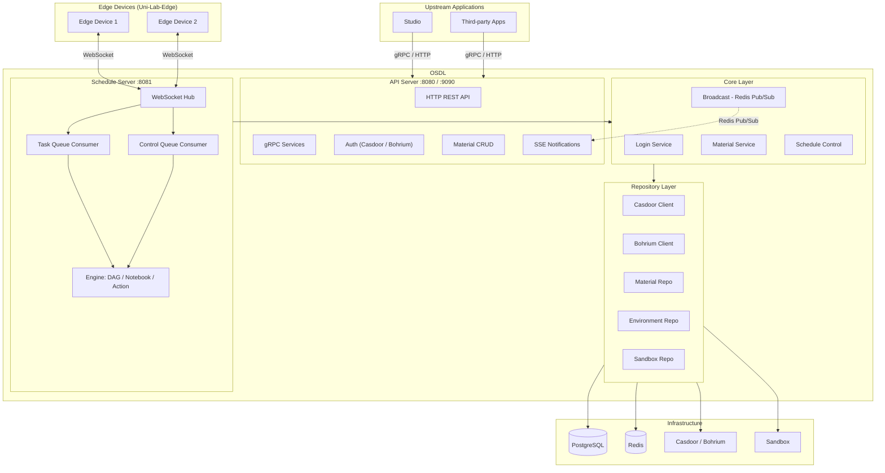
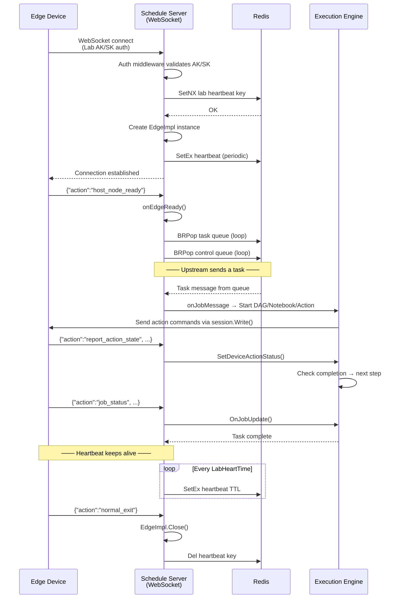
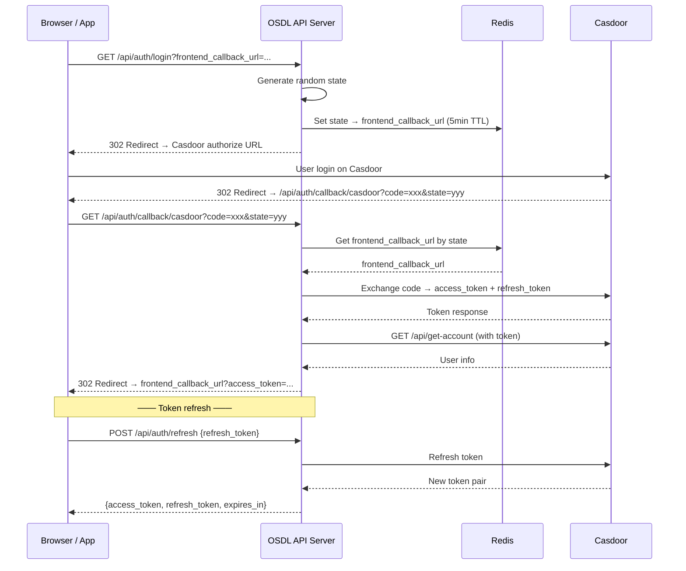
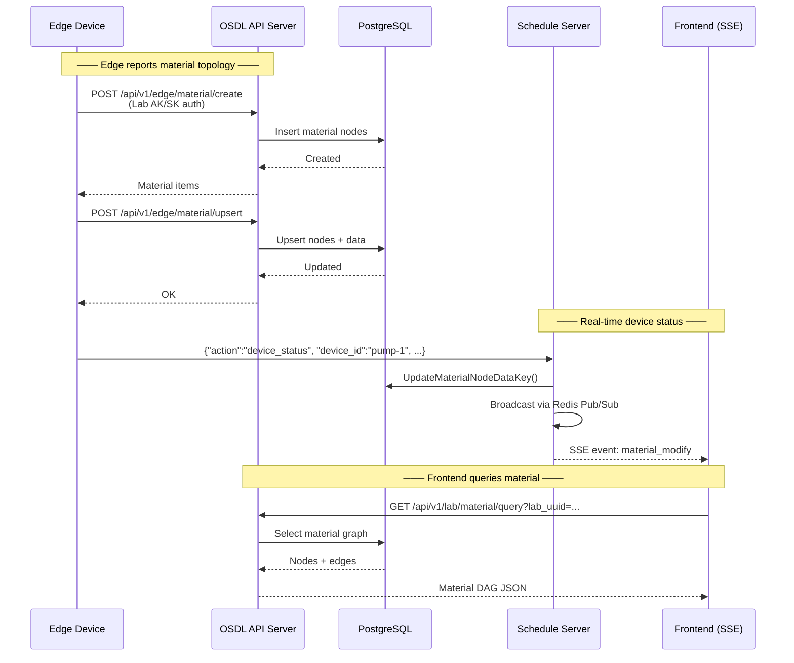
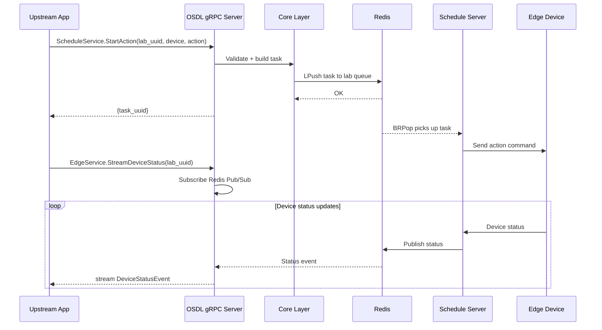

# OSDL — Open Science Device Lab

**OSDL** is a decoupled, open-source communication infrastructure for managing and orchestrating scientific laboratory Edge devices. Upstream applications (e.g. Studio, third-party systems) interact with Edge devices through OSDL's gRPC / HTTP API, while Edge software like [Uni-Lab-Edge](https://github.com/Uni-Lab-Edge/unilabos) (a DeepModeling community project) connects to OSDL from the device side. OSDL handles the full lifecycle: WebSocket connections, real-time messaging, task scheduling (DAG / Notebook / Action), material graph management, and pluggable authentication via [Casdoor](https://casdoor.org/) or [Bohrium](https://bohrium.dp.tech/).

> **Language / 语言**: English | [中文文档](./docs/README_CN.md)

---

## Architecture

```
┌──────────────────────────────────────────────────────────────────────┐
│                        Upstream Applications                        │
│                      (Studio, Third-party Apps)                     │
└──────────┬──────────────────────────────────┬────────────────────────┘
           │  gRPC (port 9090)                │  HTTP REST (port 8080)
           ▼                                  ▼
┌──────────────────────────────────────────────────────────────────────┐
│                          OSDL API Server                            │
│                                                                      │
│  ┌─────────────┐  ┌──────────────┐  ┌────────────┐  ┌────────────┐ │
│  │ Auth Module  │  │Material CRUD │  │ SSE Notify │  │ gRPC Layer │ │
│  │(Casdoor/Bohr)│  │   & Graph    │  │  (Events)  │  │  Services  │ │
│  └──────┬──────┘  └──────┬───────┘  └─────┬──────┘  └──────┬─────┘ │
│         │                │                 │                │       │
│         ▼                ▼                 ▼                ▼       │
│  ┌──────────────────────────────────────────────────────────────┐   │
│  │                      Core Business Layer                     │   │
│  │    Login ─── Material ─── Schedule ─── Notify (Broadcast)    │   │
│  └──────────────────────────────────┬───────────────────────────┘   │
│                                     │                               │
│  ┌──────────────────────────────────┴───────────────────────────┐   │
│  │                      Repository Layer                        │   │
│  │  Casdoor Repo ─ Bohrium Repo ─ Material Repo ─ Env Repo     │   │
│  │    Sandbox Repo ─── Migrate                                  │   │
│  └──────────────────────────────────┬───────────────────────────┘   │
└──────────────────────────────────────┼──────────────────────────────┘
                                       │
           ┌───────────────────────────┼───────────────────────────┐
           ▼                           ▼                           ▼
    ┌─────────────┐           ┌──────────────┐       ┌─────────────────┐
    │  PostgreSQL  │           │    Redis     │       │ Casdoor / Bohr  │
    │  (persist)   │           │ (queue/pub)  │       │  (Auth Backend) │
    └─────────────┘           └──────────────┘       └─────────────────┘

┌──────────────────────────────────────────────────────────────────────┐
│                       OSDL Schedule Server                          │
│                                                                      │
│  ┌────────────────────────────────────────────────────────────────┐  │
│  │                    WebSocket Hub (Melody)                      │  │
│  │                                                                │  │
│  │   Edge A ←──ws──→  Control  ←──ws──→  Edge B                  │  │
│  └───────────┬──────────────────────────────────┬────────────────┘  │
│              │                                  │                    │
│   ┌──────────▼──────────┐          ┌────────────▼─────────────┐     │
│   │  Task Queue (Redis) │          │  Control Queue (Redis)   │     │
│   │   BRPop consumer    │          │    BRPop consumer        │     │
│   └──────────┬──────────┘          └────────────┬─────────────┘     │
│              │                                  │                    │
│   ┌──────────▼──────────────────────────────────▼─────────────┐     │
│   │                   Execution Engine                        │     │
│   │     DAG Workflow ─── Notebook ─── Single Action           │     │
│   └───────────────────────────────────────────────────────────┘     │
└──────────────────────────────────────────────────────────────────────┘

┌──────────────────────────────────────────────────────────────────────┐
│                    Edge Devices (Uni-Lab-Edge)                       │
│            github.com/Uni-Lab-Edge/unilabos (DeepModeling)          │
│  ┌────────────┐  ┌────────────┐  ┌────────────┐                    │
│  │  Edge Dev 1 │  │  Edge Dev 2 │  │  Edge Dev N │                    │
│  └──────┬─────┘  └──────┬─────┘  └──────┬─────┘                    │
│         └───────────┬────┘───────────────┘                          │
│                     │ WebSocket (:8081)                              │
└─────────────────────┼───────────────────────────────────────────────┘
                      ▼
              OSDL Schedule Server
```

### System Architecture (Mermaid)



---

## Sequence Diagrams

### 1. Edge Device Connection & Task Execution



### 2. OAuth2 Login Flow (Casdoor)



### 3. Material Sync (Edge ↔ Platform)



### 4. gRPC Service Call Flow



---

## Project Structure

```
osdl/
├── main.go                          # Entry point — Cobra CLI (apiserver / schedule / migrate)
├── go.mod
├── Makefile                         # Build, dev, docker, lint targets
├── Dockerfile                       # Multi-stage build (alpine)
├── docker-compose.yml               # Full stack: postgres + redis + osdl-api + osdl-schedule
├── .env.example                     # Environment variable template
│
├── cmd/
│   ├── api/server.go                # API server startup (HTTP + gRPC + graceful shutdown)
│   └── schedule/server.go           # Schedule server startup (WebSocket + Redis consumer)
│
├── internal/config/                 # Configuration (env vars via Viper)
│
├── proto/osdl/v1/                   # gRPC Proto definitions
│   ├── edge.proto                   # EdgeService — device status & streaming
│   ├── schedule.proto               # ScheduleService — workflow/notebook/action
│   ├── material.proto               # MaterialService — material CRUD
│   └── auth.proto                   # AuthService — OAuth2 login/callback/refresh
│
├── pkg/
│   ├── common/                      # Shared: UUID, error codes, constants, response
│   ├── core/
│   │   ├── login/casdoor/           # Casdoor OAuth2 implementation
│   │   ├── material/                # Material business logic + Edge sync
│   │   ├── schedule/
│   │   │   ├── control/             # WebSocket hub (Melody) + connection lifecycle
│   │   │   ├── lab/edge/            # EdgeImpl — message routing & queue consumers
│   │   │   └── engine/              # Task execution: DAG, Notebook, Action
│   │   └── notify/events/           # Redis Pub/Sub broadcast system
│   ├── grpc/                        # gRPC server bootstrap
│   ├── middleware/                   # Auth, DB, Redis, Logger, OpenTelemetry
│   ├── repo/                        # Repository interfaces + implementations
│   │   ├── casdoor/                 # Casdoor auth backend
│   │   └── bohr/                    # Bohrium auth backend
│   ├── utils/                       # DAG, JWT, signal, concurrency helpers
│   └── web/                         # Gin HTTP routes + handlers
│       └── views/                   # health, login, material, schedule, sse
│
└── gen/osdl/v1/                     # protoc-generated Go code (gitignored or tracked)
```

---

## Quick Start

### Prerequisites

- Go 1.24+
- PostgreSQL 16+
- Redis 7+
- [Casdoor](https://casdoor.org/) instance (for OAuth2, default) **or** [Bohrium](https://bohrium.dp.tech/) account (set `OAUTH_SOURCE=bohr`)

### Local Development

```bash
# 1. Clone
git clone https://github.com/ScienceOL/OSDL.git && cd OSDL

# 2. Copy env and configure
cp .env.example .env
# Edit .env with your database, Redis, and Casdoor settings

# 3. Install dependencies
make init

# 4. Run database migration
make migrate

# 5. Start API server (HTTP :8080 + gRPC :9090)
make apiserver

# 6. Start Schedule server (WebSocket :8081) — in another terminal
make schedule
```

### Docker Compose (one command)

```bash
# Start everything: PostgreSQL + Redis + migrate + API + Schedule
make docker-up

# View logs
make docker-logs

# Stop
make docker-down
```

---

## API Endpoints

### Health Checks

| Method | Path                | Description                          |
|--------|---------------------|--------------------------------------|
| GET    | `/api/health`       | Basic health check                   |
| GET    | `/api/health/live`  | Liveness probe (always OK)           |
| GET    | `/api/health/ready` | Readiness probe (checks PG + Redis)  |

### Authentication

| Method | Path                           | Description                    |
|--------|--------------------------------|--------------------------------|
| GET    | `/api/auth/login`              | Initiate Casdoor OAuth2 login  |
| GET    | `/api/auth/callback/casdoor`   | OAuth2 callback                |
| POST   | `/api/auth/refresh`            | Refresh access token           |

### Material Management (Bearer auth)

| Method | Path                                     | Description                |
|--------|------------------------------------------|----------------------------|
| POST   | `/api/v1/lab/material/create`            | Create lab material        |
| POST   | `/api/v1/lab/material/save`              | Save material              |
| GET    | `/api/v1/lab/material/query`             | Query materials            |
| PUT    | `/api/v1/lab/material/update`            | Batch update               |
| GET    | `/api/v1/lab/material/download/:lab_uuid`| Download material graph    |

### Edge Device API (Lab AK/SK auth)

| Method | Path                                | Description                  |
|--------|-------------------------------------|------------------------------|
| POST   | `/api/v1/edge/material/create`      | Edge creates material nodes  |
| POST   | `/api/v1/edge/material/upsert`      | Edge upserts material        |
| POST   | `/api/v1/edge/material/edge`        | Edge creates connections     |
| GET    | `/api/v1/edge/material/download`    | Edge downloads material DAG  |

### WebSocket

| Path                                  | Server   | Description                     |
|---------------------------------------|----------|---------------------------------|
| `/api/v1/ws/material/:lab_uuid`       | API      | Material real-time updates      |
| `/api/v1/ws/schedule`                 | Schedule | Edge device ↔ OSDL connection   |

### SSE

| Path                      | Description                        |
|---------------------------|------------------------------------|
| `/api/v1/lab/notify/sse`  | Server-Sent Events for broadcasts  |

### gRPC Services (port 9090)

| Service           | Methods                                                          |
|-------------------|------------------------------------------------------------------|
| `EdgeService`     | `GetEdgeStatus`, `StreamDeviceStatus`                            |
| `ScheduleService` | `StartWorkflow`, `StartNotebook`, `StartAction`, `StopJob`, `StreamJobStatus` |
| `MaterialService` | `EdgeCreateMaterial`, `EdgeUpsertMaterial`, `EdgeCreateEdge`, `QueryMaterial`, `DownloadMaterial` |
| `AuthService`     | `Login`, `Callback`, `Refresh`                                   |

---

## Configuration

All configuration is via environment variables (loaded from `.env`):

| Variable               | Default         | Description                        |
|------------------------|-----------------|------------------------------------|
| `DATABASE_HOST`        | `localhost`     | PostgreSQL host                    |
| `DATABASE_PORT`        | `5432`          | PostgreSQL port                    |
| `DATABASE_NAME`        | `osdl`          | Database name                      |
| `DATABASE_USER`        | `postgres`      | Database user                      |
| `DATABASE_PASSWORD`    | `osdl`          | Database password                  |
| `REDIS_HOST`           | `127.0.0.1`    | Redis host                         |
| `REDIS_PORT`           | `6379`          | Redis port                         |
| `WEB_PORT`             | `8080`          | HTTP API port                      |
| `SCHEDULE_PORT`        | `8081`          | Schedule WebSocket port            |
| `GRPC_PORT`            | `9090`          | gRPC port                          |
| `OAUTH2_CLIENT_ID`     | —               | Casdoor OAuth2 client ID           |
| `OAUTH2_CLIENT_SECRET` | —               | Casdoor OAuth2 client secret       |
| `CASDOOR_ADDR`         | —               | Casdoor server address             |
| `OAUTH_SOURCE`         | `casdoor`       | Auth backend (`casdoor` or `bohr`) |
| `BOHR_CORE_ADDR`       | —               | Bohrium Core API address           |
| `ACCOUNT_ADDR`         | —               | Bohrium Account API address        |
| `BOHR_ADDR`            | —               | Bohrium API address                |
| `SANDBOX_ADDR`         | —               | Sandbox service address            |
| `LOG_LEVEL`            | `info`          | Log level (debug/info/warn/error)  |
| `ENV`                  | `dev`           | Environment (dev/prod)             |

See [`.env.example`](./.env.example) for the complete list.

---

## Make Targets

```bash
make help          # Show all available commands
make init          # Download and tidy dependencies
make apiserver     # Run API server
make schedule      # Run Schedule server
make migrate       # Run database migration
make build         # Build binary
make build-linux   # Cross-compile for Linux
make proto         # Generate gRPC code from proto files
make test          # Run tests
make fmt           # Format code
make vet           # Go vet
make lint          # Lint (golangci-lint)
make docker-build  # Build Docker image
make docker-up     # Start full stack with docker-compose
make docker-down   # Stop all services
make docker-logs   # Tail logs
make clean         # Clean build artifacts
```

---

## Tech Stack

| Component        | Technology                                   |
|------------------|----------------------------------------------|
| Language         | Go 1.24                                      |
| HTTP Framework   | [Gin](https://github.com/gin-gonic/gin)      |
| WebSocket        | [Melody](https://github.com/olahol/melody)   |
| gRPC             | [gRPC-Go](https://google.golang.org/grpc)    |
| ORM              | [GORM](https://gorm.io/) + PostgreSQL        |
| Cache / Queue    | [Redis](https://redis.io/) (go-redis/v9)     |
| Authentication   | [Casdoor](https://casdoor.org/) or [Bohrium](https://bohrium.dp.tech/) |
| CLI              | [Cobra](https://github.com/spf13/cobra)      |
| Config           | [Viper](https://github.com/spf13/viper)      |
| Logging          | [Zap](https://github.com/uber-go/zap)        |
| Tracing          | [OpenTelemetry](https://opentelemetry.io/)    |
| Goroutine Pool   | [ants](https://github.com/panjf2000/ants)    |
| Container        | Docker + Docker Compose                       |

---

## License

[AGPL-3.0](./LICENSE)
