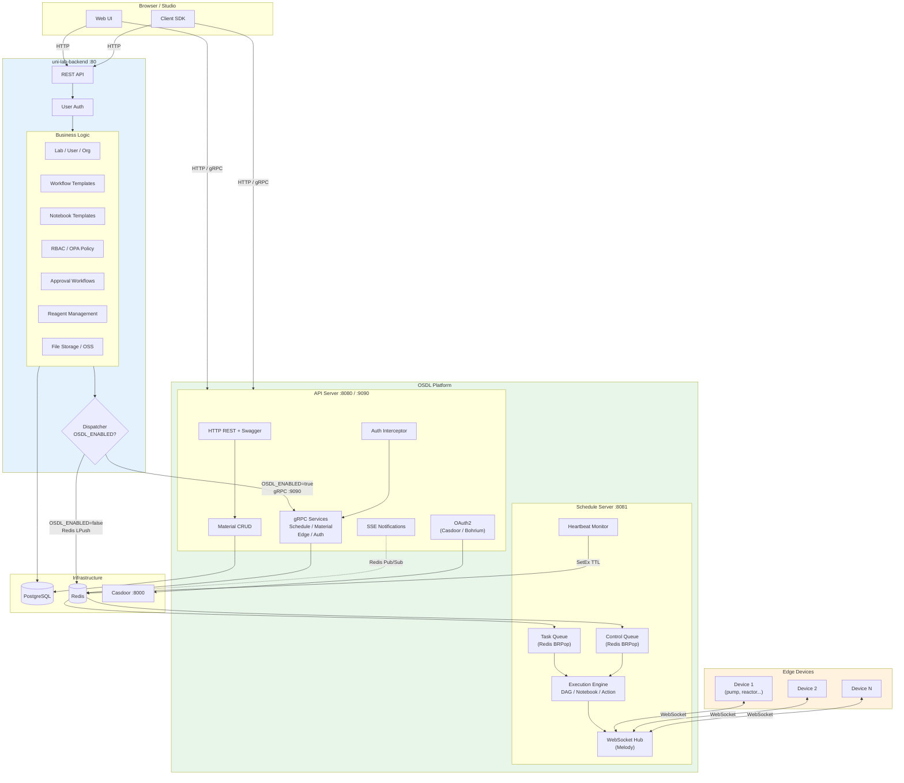
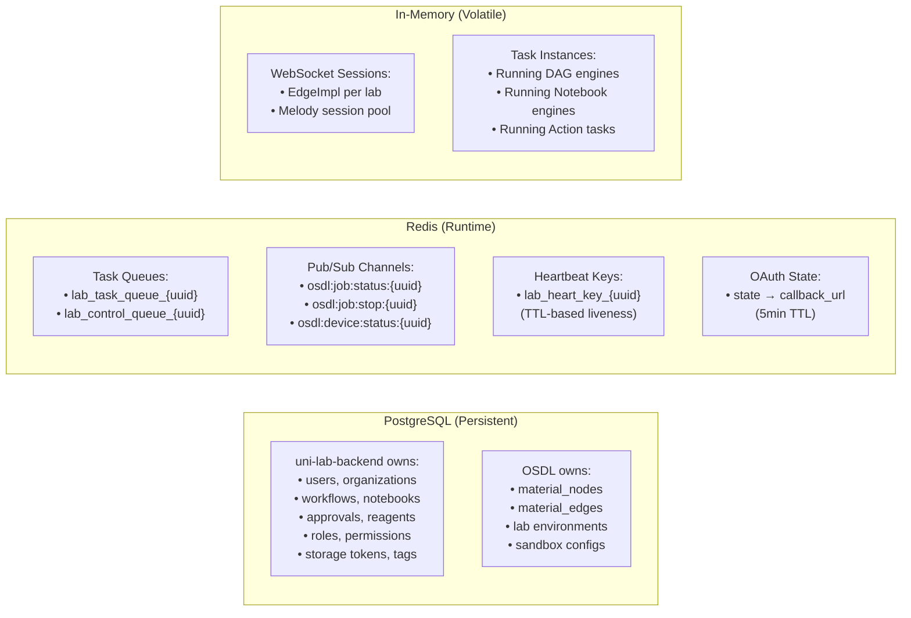
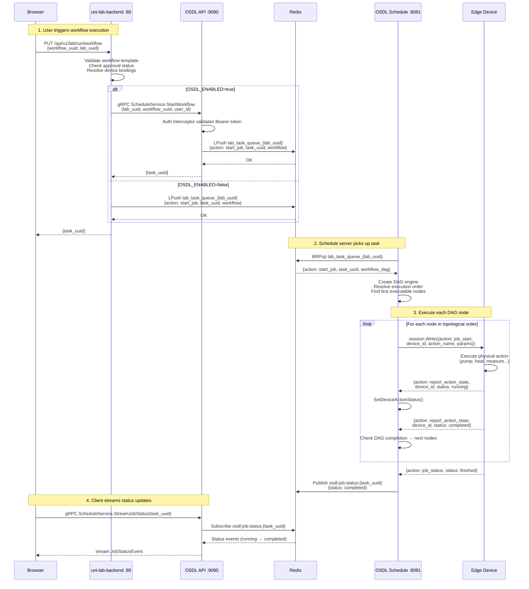
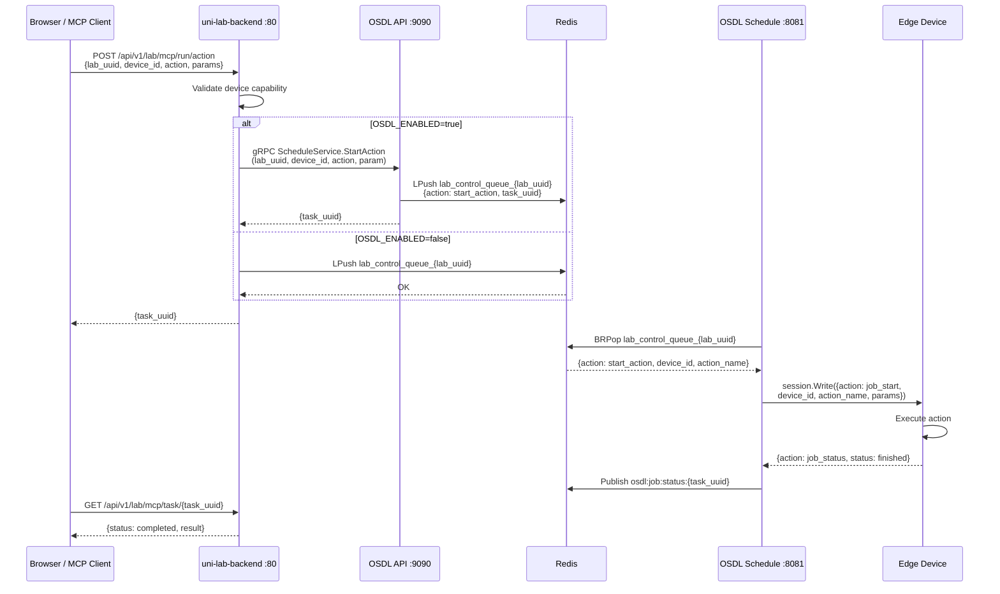
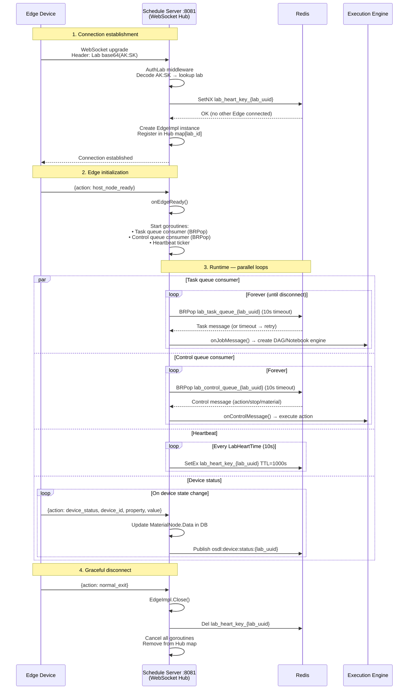
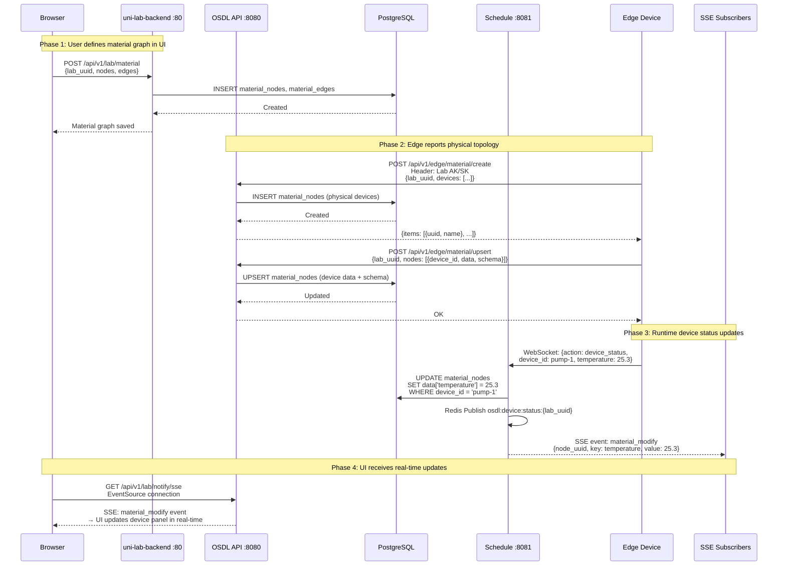
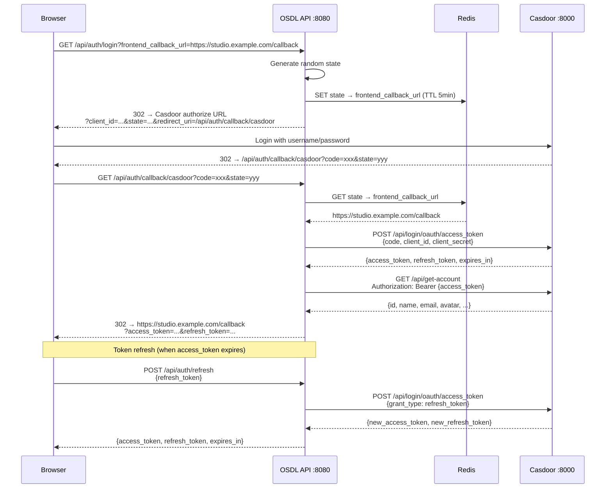
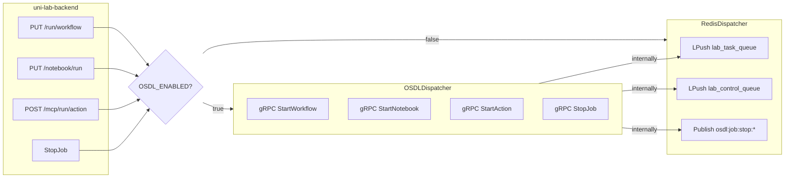

# OSDL System Architecture — Complete Functional Division & Data Flow

This document provides a comprehensive view of the **OSDL + uni-lab-backend + Edge** three-tier architecture, covering the complete functional boundary, data ownership, integration points, and runtime data flow.

> **Language / 语言**: English | [中文版](./ARCHITECTURE_CN.md)

---

## 1. System Overview

The full-stack scientific laboratory platform consists of three independent deployments:

| Component | Role | Ports | Technology |
|-----------|------|-------|------------|
| **uni-lab-backend** | Business logic, user management, templates, approval | HTTP :80 | Go + Gin + GORM + PostgreSQL |
| **OSDL API Server** | Edge communication gateway, gRPC API, OAuth2 | HTTP :8080 + gRPC :9090 | Go + Gin + gRPC + Redis |
| **OSDL Schedule Server** | WebSocket hub, task execution engine | WS :8081 | Go + Melody + Redis |
| **Edge Devices** | Physical lab instruments (Uni-Lab-Edge / unilabos) | — | Python / C++ |

```
┌─────────────────────────────────────────────────────────────────────────────┐
│                        Browser / Client / Studio                            │
└──────┬──────────────────────────────┬───────────────────────────────────────┘
       │ HTTP :80                     │ HTTP :8080 / gRPC :9090
       ▼                              ▼
┌──────────────────┐           ┌──────────────────────────┐
│ uni-lab-backend   │──gRPC───→│    OSDL API Server       │
│                   │          │                          │
│ Users / Workflows │          │  Material CRUD           │
│ Notebooks / RBAC  │          │  OAuth2 (Casdoor/Bohr)  │
│ Approval / Storage│          │  gRPC Services (×4)      │
│ Reagent / OPA     │          │  SSE Notifications       │
│ Nacos / Templates │          │  Swagger UI              │
└──────────────────┘           └────────────┬─────────────┘
                                            │ Redis Queues + Pub/Sub
                                            ▼
                               ┌──────────────────────────┐
                               │  OSDL Schedule Server     │
                               │                          │
                               │  WebSocket Hub (Melody)  │
                               │  Task Queue Consumer     │
                               │  Control Queue Consumer  │
                               │  Engine: DAG / Notebook  │
                               │          / Action        │
                               └────────────┬─────────────┘
                                            │ WebSocket :8081
                                            ▼
                               ┌──────────────────────────┐
                               │  Edge Devices             │
                               │  (Uni-Lab-Edge / unilabos)│
                               └──────────────────────────┘
```

---

## 2. Mermaid Architecture Diagram



---

## 3. Complete Functional Division

### 3.1 uni-lab-backend (75% — Business Logic Layer)

| Domain | Module | Key Operations | Data Store |
|--------|--------|----------------|------------|
| **User / Org** | `core/environment/` | User profile, lab CRUD, member invite/remove, lab pin | PostgreSQL |
| **Authorization** | `core/inner/` + OPA | RBAC roles, role permissions, user-role binding, custom policies | PostgreSQL + OPA |
| **Workflow Templates** | `core/workflow/` | Template CRUD, fork, import/export, versioning, tagging | PostgreSQL |
| **Workflow Node Templates** | `core/workflow/` | Node template CRUD, schema definition, device capability query | PostgreSQL |
| **Notebook Templates** | `core/notebook/` | Notebook CRUD, sample tracking, schema definition | PostgreSQL |
| **Material Definition** | `core/material/` (UI) | Material graph creation in web UI, template management | PostgreSQL |
| **Reagent** | `core/reagent/` | Reagent CRUD, CAS lookup (PubChem API) | PostgreSQL |
| **Approval** | `core/sse/` | Workflow submission, approval chain, approve/reject | PostgreSQL |
| **File Storage** | `core/storage/` | Pre-signed URL generation, OSS integration | OSS (S3) |
| **Notifications** | `core/notify/` + `core/sse/` | SSE stream, notification CRUD, cross-pod broadcast | Redis Pub/Sub |
| **Dynamic Config** | Nacos | Hot-reload configuration, feature flags | Nacos |
| **Task Dispatch** | `core/schedule/` | Workflow/Notebook/Action dispatch via `Dispatcher` interface | — |
| **Task History** | `web/views/workflow/` | Task list, task download, status query | PostgreSQL |

### 3.2 OSDL (25% — Edge Communication & Scheduling Layer)

| Domain | Module | Key Operations | Data Store |
|--------|--------|----------------|------------|
| **Edge Connectivity** | `core/schedule/control/` | WebSocket session lifecycle (Melody), 200-conn pool | In-memory |
| **Edge Auth** | `middleware/auth/` | Lab AK/SK header validation (`Lab base64(AK:SK)`) | PostgreSQL |
| **Heartbeat** | `core/schedule/lab/edge/` | Periodic `SetEx` to `lab_heart_key_{lab_uuid}` (TTL 1000s) | Redis |
| **Task Execution** | `core/schedule/engine/` | DAG workflow, Notebook, single Action execution | Redis |
| **Queue Consumption** | `core/schedule/lab/edge/` | BRPop from `lab_task_queue_*` and `lab_control_queue_*` | Redis |
| **Material Runtime** | `core/material/` | Edge-reported material create/upsert, device status sync | PostgreSQL |
| **Device Status** | `core/schedule/lab/edge/` | Device property updates broadcast via Redis Pub/Sub | Redis Pub/Sub |
| **OAuth2** | `core/login/casdoor/` + `repo/bohr/` | Casdoor OAuth2 + Bohrium JWT, switchable via `OAUTH_SOURCE` | Redis (state) |
| **gRPC API** | `pkg/grpc/services/` | 4 services, 14 RPCs for upstream integration | Redis + PostgreSQL |
| **HTTP API** | `pkg/web/` | Material CRUD, health checks, SSE, Swagger UI | PostgreSQL |

### 3.3 Edge Devices (Physical Layer)

| Domain | Operations |
|--------|-----------|
| **Device Control** | Execute actions (pump, heat, stir, measure...) |
| **Status Reporting** | Push device_status messages via WebSocket |
| **Material Topology** | Report physical device graph (POST to OSDL Edge API) |
| **Task Execution** | Receive action commands, report completion via job_status |
| **Heartbeat** | Periodic ping/pong to maintain connection liveness |

---

## 4. Data Ownership



---

## 5. Sequence Diagrams

### 5.1 Workflow Execution (Full Path)



### 5.2 Single Action Execution (MCP)



### 5.3 Edge Device Connection Lifecycle



### 5.4 Material Graph Sync (Definition → Runtime)



### 5.5 OAuth2 Login Flow



---

## 6. Integration Point — Dispatcher Interface

The **single integration point** between uni-lab-backend and OSDL is the `Dispatcher` interface:

```go
type Dispatcher interface {
    StartWorkflow(ctx, labUUID, workflowUUID, userID) (taskUUID, error)
    StartNotebook(ctx, labUUID, notebookUUID, userID) (taskUUID, error)
    StartAction(ctx, labUUID, deviceID, action, actionType, param) (taskUUID, error)
    StopJob(ctx, taskUUID, userID) error
}
```



**Rollback**: Set `OSDL_ENABLED=false` → instant fallback to direct Redis, no data migration needed.

---

## 7. Redis Key Reference

| Key Pattern | Type | Owner | TTL | Purpose |
|-------------|------|-------|-----|---------|
| `lab_task_queue_{lab_uuid}` | List | OSDL / ULB | — | Workflow + Notebook task dispatch |
| `lab_control_queue_{lab_uuid}` | List | OSDL / ULB | — | Action + Stop + Material control |
| `lab_heart_key_{lab_uuid}` | String | OSDL Schedule | 1000s | Edge device liveness (heartbeat) |
| `osdl:job:status:{task_uuid}` | Pub/Sub | OSDL Schedule | — | Job status streaming channel |
| `osdl:job:stop:{task_uuid}` | Pub/Sub | OSDL API | — | Stop command broadcast |
| `osdl:device:status:{lab_uuid}` | Pub/Sub | OSDL Schedule | — | Device status streaming channel |
| OAuth state key | String | OSDL API | 5min | OAuth2 state → callback_url mapping |

---

## 8. Authentication Matrix

| Auth Type | Header Format | Validator | Used By |
|-----------|---------------|-----------|---------|
| **Bearer** | `Authorization: Bearer <token>` | Casdoor UserInfo / Bohrium RSA JWT | Web users (browser, SDK) |
| **Lab** | `Authorization: Lab base64(AK:SK)` | Database lookup | Edge devices |
| **Api** | `Authorization: Bearer <jwt>` | Bohrium RSA public key | API integrations |
| **gRPC metadata** | `authorization: Bearer <token>` | Auth interceptor → ValidateToken | Upstream gRPC clients |

Switchable via `OAUTH_SOURCE` environment variable:
- `casdoor` (default): Casdoor OAuth2 Authorization Code + UserInfo endpoint
- `bohr`: Bohrium JWT with RSA public key verification (JWKS)

---

## 9. WebSocket Message Protocol

### Edge → OSDL (Schedule Server)

| Action | Payload | Trigger |
|--------|---------|---------|
| `host_node_ready` | `{}` | Edge initialization complete |
| `device_status` | `{device_id, property, value}` | Device state change |
| `report_action_state` | `{device_id, action, status}` | Action execution progress |
| `job_status` | `{job_id, status, data}` | Task completion report |
| `ping` | `{}` | Heartbeat request |
| `normal_exit` | `{}` | Graceful disconnect |

### OSDL → Edge (Schedule Server)

| Action | Payload | Trigger |
|--------|---------|---------|
| `job_start` | `{device_id, action, params}` | Task dispatch to device |
| `query_action_state` | `{device_id, action}` | Check device capability |
| `cancel_task` | `{task_uuid}` | Stop running task |
| `task_finished` | `{task_uuid}` | Task completion notification |
| `add_material` | `{node data}` | Material topology update |
| `update_material` | `{node data}` | Material data update |
| `remove_material` | `{node_uuid}` | Material node removal |
| `pong` | `{}` | Heartbeat response |

---

## 10. Deployment Topology

### Development (Docker Compose)

```
┌─ docker/docker-compose.infra.yaml ─────────────────────┐
│  network-service (alpine) ← shared network namespace    │
│  ├── postgresql :5432   (db-data volume)                │
│  ├── redis :6379        (redis-data volume)             │
│  └── casdoor :8000      (optional)                      │
└─────────────────────────────────────────────────────────┘

┌─ docker/docker-compose.base.yaml + dev.yaml ────────────┐
│  network-service (alpine) ← dev ports :8080 :8081 :9090 │
│  ├── api (golang:1.24-alpine)                           │
│  │   └── make dev (air hot-reload .air.web.toml)        │
│  └── schedule (golang:1.24-alpine)                      │
│      └── make dev-schedule (air .air.schedule.toml)     │
│                                                         │
│  Volumes: source mount, go-mod-cache, go-bin-cache      │
│  Env: host.docker.internal for PG / Redis / Casdoor     │
└─────────────────────────────────────────────────────────┘
```

### Production

```
┌─ docker-compose.yml ────────────────────────────────────┐
│  postgres :5432    (pgdata volume, healthcheck)         │
│  redis :6379       (redisdata volume, healthcheck)      │
│  osdl-migrate      (one-shot, depends_on: pg healthy)   │
│  osdl-api :8080 :9090  (depends_on: pg, redis, migrate) │
│  osdl-schedule :8081   (depends_on: pg, redis, migrate) │
└─────────────────────────────────────────────────────────┘
```

---

## 11. Migration Strategy

| Phase | Description | Flag | Risk |
|-------|-------------|------|------|
| **0. Side-by-side** | Deploy OSDL alongside uni-lab-backend, `OSDL_ENABLED=false` | `false` | None — no behavioral change |
| **1. Canary** | Enable for 1 test lab, monitor gRPC latency + task completion | `true` (per-lab) | Low — single lab affected |
| **2. Gradual rollout** | Enable for all labs, dual-write mode for comparison | `true` | Medium — monitor Redis queue depth |
| **3. Full migration** | All Edge connections through OSDL Schedule server | `true` | — |
| **4. Cleanup** | Remove RedisDispatcher code, schedule server from uni-lab-backend | N/A | — |

**Rollback at any phase**: Set `OSDL_ENABLED=false`, restart uni-lab-backend. Instant, no data migration.

---

## 12. Functional Division Summary

```
┌─────────────────────────────────────────────────────────────────────┐
│                        uni-lab-backend (75%)                        │
│                                                                     │
│  Users & Orgs ─── Labs ─── RBAC ─── OPA Policy                    │
│  Workflow Templates ─── Node Templates ─── Versioning              │
│  Notebook Templates ─── Samples ─── Schema                        │
│  Approval Workflows ─── Notification CRUD                          │
│  Reagent CRUD ─── PubChem ─── CAS Lookup                          │
│  File Storage ─── OSS Pre-signed URLs                              │
│  Dynamic Config (Nacos) ─── Feature Flags                          │
│  Task History ─── Task Download                                    │
│                                                                     │
│  Dispatcher ─────────────────────────────┐                         │
│    ├── RedisDispatcher (OSDL_ENABLED=false)                        │
│    └── OSDLDispatcher (OSDL_ENABLED=true) ──→ gRPC                │
└─────────────────────────────────────────────┼───────────────────────┘
                                              │
                                              ▼
┌─────────────────────────────────────────────────────────────────────┐
│                            OSDL (25%)                               │
│                                                                     │
│  ┌─ API Server ─────────────────────────────────────────────┐      │
│  │  OAuth2 (Casdoor / Bohrium) ─── Token Validation          │      │
│  │  Material CRUD (Web + Edge) ─── Material WebSocket        │      │
│  │  gRPC Services (4) ─── Auth Interceptor                   │      │
│  │  SSE Notifications ─── Health Checks ─── Swagger UI       │      │
│  └───────────────────────────────────────────────────────────┘      │
│                                                                     │
│  ┌─ Schedule Server ────────────────────────────────────────┐      │
│  │  WebSocket Hub (Melody, 200 conns)                        │      │
│  │  Task Queue Consumer (BRPop) ─── Control Queue Consumer   │      │
│  │  DAG Engine ─── Notebook Engine ─── Action Engine         │      │
│  │  Heartbeat Monitor ─── Device Status Broadcast            │      │
│  └───────────────────────────────────────────────────────────┘      │
│                                                                     │
│  Edge Devices ←──── WebSocket :8081 ────→ Physical Lab Hardware    │
└─────────────────────────────────────────────────────────────────────┘
```
