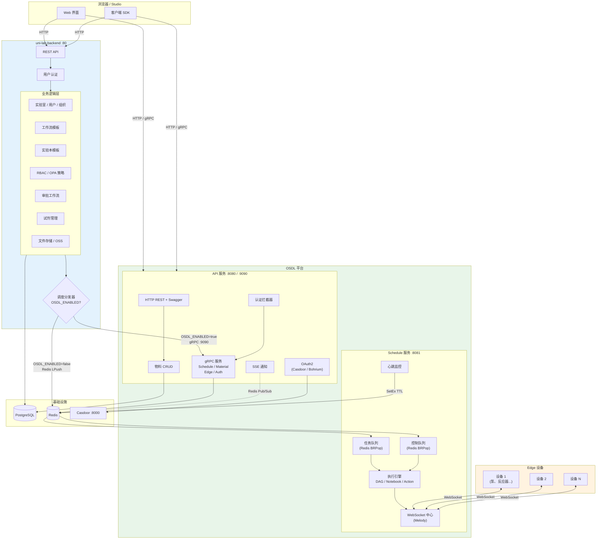
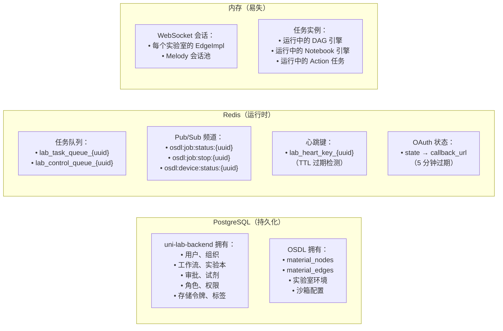
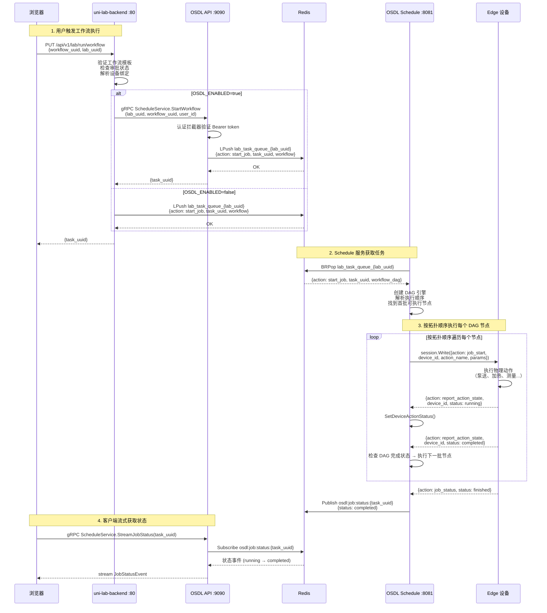
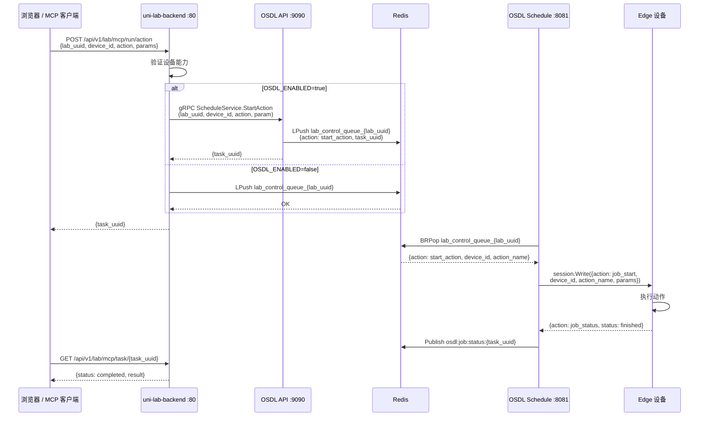
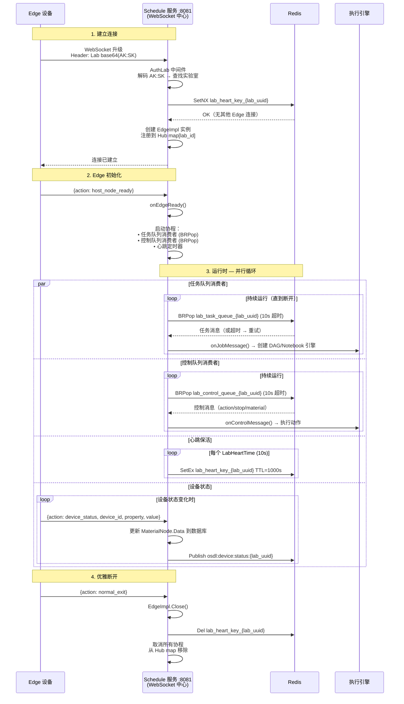
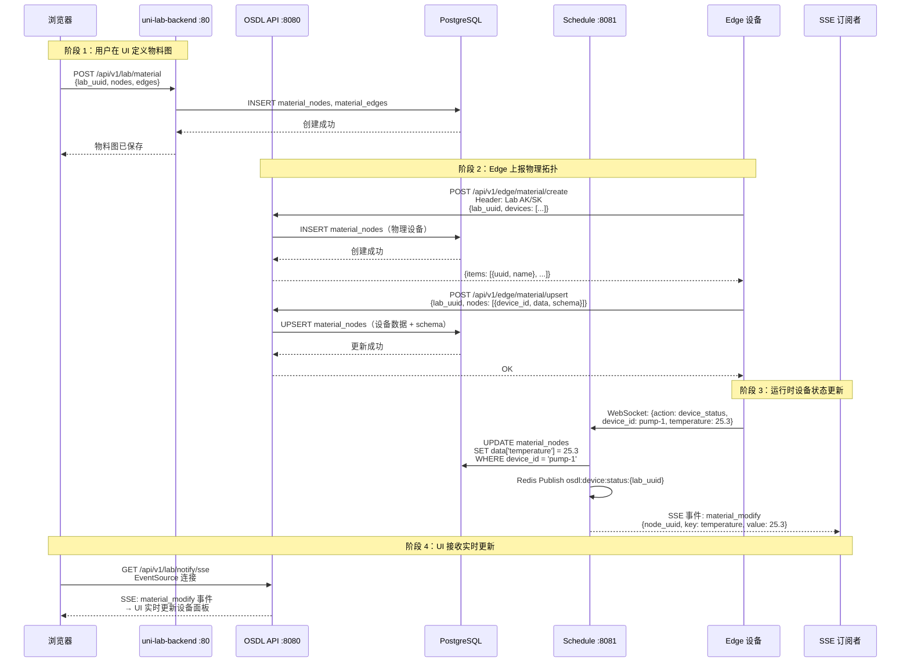
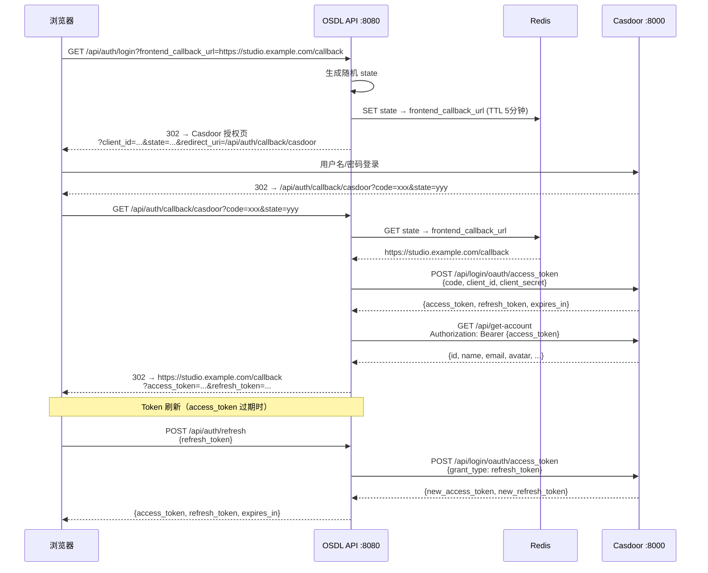
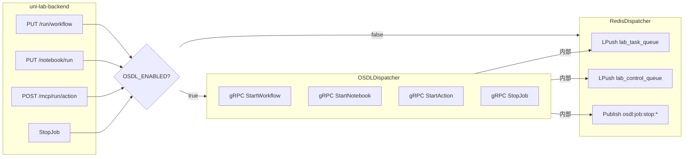

# OSDL 系统架构 — 完整功能划分与数据流转

本文档提供 **OSDL + uni-lab-backend + Edge** 三层架构的完整视图，涵盖功能边界、数据归属、集成点和运行时数据流转。

> **语言 / Language**: 中文 | [English](./ARCHITECTURE.md)

---

## 1. 系统总览

完整的科学实验室平台由三个独立部署组成：

| 组件 | 角色 | 端口 | 技术栈 |
|------|------|------|--------|
| **uni-lab-backend** | 业务逻辑、用户管理、模板、审批 | HTTP :80 | Go + Gin + GORM + PostgreSQL |
| **OSDL API 服务** | Edge 通信网关、gRPC API、OAuth2 | HTTP :8080 + gRPC :9090 | Go + Gin + gRPC + Redis |
| **OSDL Schedule 服务** | WebSocket 中心、任务执行引擎 | WS :8081 | Go + Melody + Redis |
| **Edge 设备** | 物理实验室仪器 (Uni-Lab-Edge / unilabos) | — | Python / C++ |

```
┌─────────────────────────────────────────────────────────────────────────────┐
│                        浏览器 / 客户端 / Studio                              │
└──────┬──────────────────────────────┬───────────────────────────────────────┘
       │ HTTP :80                     │ HTTP :8080 / gRPC :9090
       ▼                              ▼
┌──────────────────┐           ┌──────────────────────────┐
│ uni-lab-backend   │──gRPC───→│    OSDL API 服务          │
│                   │          │                          │
│ 用户 / 工作流     │          │  物料 CRUD               │
│ 实验本 / RBAC     │          │  OAuth2 (Casdoor/Bohr)  │
│ 审批 / 存储       │          │  gRPC 服务 (×4)          │
│ 试剂 / OPA        │          │  SSE 通知               │
│ Nacos / 模板      │          │  Swagger UI              │
└──────────────────┘           └────────────┬─────────────┘
                                            │ Redis 队列 + Pub/Sub
                                            ▼
                               ┌──────────────────────────┐
                               │  OSDL Schedule 服务       │
                               │                          │
                               │  WebSocket 中心 (Melody) │
                               │  任务队列消费者           │
                               │  控制队列消费者           │
                               │  引擎: DAG / Notebook    │
                               │        / Action          │
                               └────────────┬─────────────┘
                                            │ WebSocket :8081
                                            ▼
                               ┌──────────────────────────┐
                               │  Edge 设备                │
                               │ (Uni-Lab-Edge / unilabos) │
                               └──────────────────────────┘
```

---

## 2. Mermaid 架构图



---

## 3. 完整功能划分

### 3.1 uni-lab-backend（75% — 业务逻辑层）

| 领域 | 模块 | 核心操作 | 数据存储 |
|------|------|----------|----------|
| **用户 / 组织** | `core/environment/` | 用户管理、实验室 CRUD、成员邀请/移除、实验室置顶 | PostgreSQL |
| **权限控制** | `core/inner/` + OPA | RBAC 角色、角色权限、用户角色绑定、自定义策略 | PostgreSQL + OPA |
| **工作流模板** | `core/workflow/` | 模板 CRUD、Fork、导入/导出、版本管理、标签分类 | PostgreSQL |
| **工作流节点模板** | `core/workflow/` | 节点模板 CRUD、Schema 定义、设备能力查询 | PostgreSQL |
| **实验本模板** | `core/notebook/` | 实验本 CRUD、样本追踪、Schema 定义 | PostgreSQL |
| **物料定义** | `core/material/` (UI) | 在 Web 界面创建物料图、模板管理 | PostgreSQL |
| **试剂管理** | `core/reagent/` | 试剂 CRUD、CAS 号查询 (PubChem API) | PostgreSQL |
| **审批工作流** | `core/sse/` | 工作流提交审批、审批链定义、批准/拒绝 | PostgreSQL |
| **文件存储** | `core/storage/` | 预签名 URL 生成、OSS 集成 | OSS (S3) |
| **通知系统** | `core/notify/` + `core/sse/` | SSE 流、通知 CRUD、跨 Pod 广播 | Redis Pub/Sub |
| **动态配置** | Nacos | 热加载配置、功能开关 | Nacos |
| **任务分发** | `core/schedule/` | 通过 `Dispatcher` 接口分发工作流/实验本/Action | — |
| **任务历史** | `web/views/workflow/` | 任务列表、任务下载、状态查询 | PostgreSQL |

### 3.2 OSDL（25% — Edge 通信与调度层）

| 领域 | 模块 | 核心操作 | 数据存储 |
|------|------|----------|----------|
| **Edge 连接** | `core/schedule/control/` | WebSocket 会话生命周期 (Melody)、200 连接池 | 内存 |
| **Edge 认证** | `middleware/auth/` | Lab AK/SK 头部验证 (`Lab base64(AK:SK)`) | PostgreSQL |
| **心跳监控** | `core/schedule/lab/edge/` | 定期 `SetEx` 到 `lab_heart_key_{lab_uuid}` (TTL 1000s) | Redis |
| **任务执行** | `core/schedule/engine/` | DAG 工作流、实验本、单步 Action 执行 | Redis |
| **队列消费** | `core/schedule/lab/edge/` | BRPop 消费 `lab_task_queue_*` 和 `lab_control_queue_*` | Redis |
| **物料运行时** | `core/material/` | Edge 上报物料创建/更新、设备状态同步 | PostgreSQL |
| **设备状态** | `core/schedule/lab/edge/` | 设备属性更新通过 Redis Pub/Sub 广播 | Redis Pub/Sub |
| **OAuth2** | `core/login/casdoor/` + `repo/bohr/` | Casdoor OAuth2 + Bohrium JWT，通过 `OAUTH_SOURCE` 切换 | Redis (state) |
| **gRPC API** | `pkg/grpc/services/` | 4 个服务、14 个 RPC 供上游集成 | Redis + PostgreSQL |
| **HTTP API** | `pkg/web/` | 物料 CRUD、健康检查、SSE、Swagger UI | PostgreSQL |

### 3.3 Edge 设备（物理层）

| 领域 | 操作 |
|------|------|
| **设备控制** | 执行动作（泵、加热、搅拌、测量...） |
| **状态上报** | 通过 WebSocket 推送 device_status 消息 |
| **物料拓扑** | 上报物理设备图（POST 到 OSDL Edge API） |
| **任务执行** | 接收动作指令，通过 job_status 上报完成 |
| **心跳保活** | 定期 ping/pong 维持连接活跃 |

---

## 4. 数据归属



---

## 5. 时序图

### 5.1 工作流执行（完整路径）



### 5.2 单步 Action 执行（MCP）



### 5.3 Edge 设备连接生命周期



### 5.4 物料图同步（定义 → 运行时）



### 5.5 OAuth2 登录流程



---

## 6. 集成点 — Dispatcher 接口

uni-lab-backend 和 OSDL 之间的**唯一集成点**是 `Dispatcher` 接口：

```go
type Dispatcher interface {
    StartWorkflow(ctx, labUUID, workflowUUID, userID) (taskUUID, error)
    StartNotebook(ctx, labUUID, notebookUUID, userID) (taskUUID, error)
    StartAction(ctx, labUUID, deviceID, action, actionType, param) (taskUUID, error)
    StopJob(ctx, taskUUID, userID) error
}
```



**回滚**：设置 `OSDL_ENABLED=false` → 即时回退到直接 Redis，无需数据迁移。

---

## 7. Redis 键参考

| 键模式 | 类型 | 所有者 | TTL | 用途 |
|--------|------|--------|-----|------|
| `lab_task_queue_{lab_uuid}` | List | OSDL / ULB | — | 工作流 + 实验本任务分发 |
| `lab_control_queue_{lab_uuid}` | List | OSDL / ULB | — | Action + 停止 + 物料控制 |
| `lab_heart_key_{lab_uuid}` | String | OSDL Schedule | 1000s | Edge 设备存活检测（心跳） |
| `osdl:job:status:{task_uuid}` | Pub/Sub | OSDL Schedule | — | 任务状态流式频道 |
| `osdl:job:stop:{task_uuid}` | Pub/Sub | OSDL API | — | 停止命令广播 |
| `osdl:device:status:{lab_uuid}` | Pub/Sub | OSDL Schedule | — | 设备状态流式频道 |
| OAuth state key | String | OSDL API | 5min | OAuth2 state → callback_url 映射 |

---

## 8. 认证矩阵

| 认证类型 | Header 格式 | 验证方式 | 使用场景 |
|----------|------------|----------|----------|
| **Bearer** | `Authorization: Bearer <token>` | Casdoor UserInfo / Bohrium RSA JWT | Web 用户（浏览器、SDK） |
| **Lab** | `Authorization: Lab base64(AK:SK)` | 数据库查询 | Edge 设备 |
| **Api** | `Authorization: Bearer <jwt>` | Bohrium RSA 公钥 | API 集成 |
| **gRPC metadata** | `authorization: Bearer <token>` | 认证拦截器 → ValidateToken | 上游 gRPC 客户端 |

通过 `OAUTH_SOURCE` 环境变量切换：
- `casdoor`（默认）：Casdoor OAuth2 授权码 + UserInfo 端点
- `bohr`：Bohrium JWT + RSA 公钥验证 (JWKS)

---

## 9. WebSocket 消息协议

### Edge → OSDL（Schedule 服务）

| 动作 | 载荷 | 触发条件 |
|------|------|----------|
| `host_node_ready` | `{}` | Edge 初始化完成 |
| `device_status` | `{device_id, property, value}` | 设备状态变化 |
| `report_action_state` | `{device_id, action, status}` | 动作执行进度 |
| `job_status` | `{job_id, status, data}` | 任务完成上报 |
| `ping` | `{}` | 心跳请求 |
| `normal_exit` | `{}` | 优雅断开 |

### OSDL → Edge（Schedule 服务）

| 动作 | 载荷 | 触发条件 |
|------|------|----------|
| `job_start` | `{device_id, action, params}` | 任务下发到设备 |
| `query_action_state` | `{device_id, action}` | 查询设备能力 |
| `cancel_task` | `{task_uuid}` | 停止运行中的任务 |
| `task_finished` | `{task_uuid}` | 任务完成通知 |
| `add_material` | `{node data}` | 物料拓扑更新 |
| `update_material` | `{node data}` | 物料数据更新 |
| `remove_material` | `{node_uuid}` | 物料节点移除 |
| `pong` | `{}` | 心跳响应 |

---

## 10. 部署拓扑

### 开发环境（Docker Compose）

```
┌─ docker/docker-compose.infra.yaml ─────────────────────┐
│  network-service (alpine) ← 共享网络命名空间             │
│  ├── postgresql :5432   (db-data 卷)                    │
│  ├── redis :6379        (redis-data 卷)                 │
│  └── casdoor :8000      (可选)                          │
└─────────────────────────────────────────────────────────┘

┌─ docker/docker-compose.base.yaml + dev.yaml ────────────┐
│  network-service (alpine) ← 开发端口 :8080 :8081 :9090  │
│  ├── api (golang:1.24-alpine)                           │
│  │   └── make dev (air 热重载 .air.web.toml)            │
│  └── schedule (golang:1.24-alpine)                      │
│      └── make dev-schedule (air .air.schedule.toml)     │
│                                                         │
│  卷: 源码挂载, go-mod-cache, go-bin-cache               │
│  环境: host.docker.internal 连接 PG / Redis / Casdoor    │
└─────────────────────────────────────────────────────────┘
```

### 生产环境

```
┌─ docker-compose.yml ────────────────────────────────────┐
│  postgres :5432    (pgdata 卷, 健康检查)                 │
│  redis :6379       (redisdata 卷, 健康检查)              │
│  osdl-migrate      (一次性, depends_on: pg healthy)      │
│  osdl-api :8080 :9090  (depends_on: pg, redis, migrate) │
│  osdl-schedule :8081   (depends_on: pg, redis, migrate) │
└─────────────────────────────────────────────────────────┘
```

---

## 11. 迁移策略

| 阶段 | 描述 | 开关 | 风险 |
|------|------|------|------|
| **0. 并行部署** | 在 uni-lab-backend 旁部署 OSDL，`OSDL_ENABLED=false` | `false` | 无 — 行为不变 |
| **1. 灰度** | 为 1 个测试实验室启用，监控 gRPC 延迟 + 任务完成率 | `true`（按实验室） | 低 — 仅影响单个实验室 |
| **2. 逐步推广** | 为所有实验室启用，双写模式对比 | `true` | 中 — 监控 Redis 队列深度 |
| **3. 全量迁移** | 所有 Edge 连接通过 OSDL Schedule 服务 | `true` | — |
| **4. 清理** | 移除 RedisDispatcher 代码，移除 uni-lab-backend 中的 schedule 服务 | N/A | — |

**任意阶段回滚**：设置 `OSDL_ENABLED=false`，重启 uni-lab-backend。即时生效，无需数据迁移。

---

## 12. 功能划分总览

```
┌─────────────────────────────────────────────────────────────────────┐
│                      uni-lab-backend (75%)                          │
│                                                                     │
│  用户 & 组织 ─── 实验室 ─── RBAC ─── OPA 策略                      │
│  工作流模板 ─── 节点模板 ─── 版本管理                                │
│  实验本模板 ─── 样本 ─── Schema                                     │
│  审批工作流 ─── 通知 CRUD                                           │
│  试剂 CRUD ─── PubChem ─── CAS 查询                                │
│  文件存储 ─── OSS 预签名 URL                                        │
│  动态配置 (Nacos) ─── 功能开关                                      │
│  任务历史 ─── 任务下载                                              │
│                                                                     │
│  Dispatcher ─────────────────────────────┐                         │
│    ├── RedisDispatcher (OSDL_ENABLED=false)                        │
│    └── OSDLDispatcher (OSDL_ENABLED=true) ──→ gRPC                │
└─────────────────────────────────────────────┼───────────────────────┘
                                              │
                                              ▼
┌─────────────────────────────────────────────────────────────────────┐
│                            OSDL (25%)                               │
│                                                                     │
│  ┌─ API 服务 ───────────────────────────────────────────────┐      │
│  │  OAuth2 (Casdoor / Bohrium) ─── Token 验证                │      │
│  │  物料 CRUD (Web + Edge) ─── 物料 WebSocket                │      │
│  │  gRPC 服务 (4个) ─── 认证拦截器                            │      │
│  │  SSE 通知 ─── 健康检查 ─── Swagger UI                     │      │
│  └───────────────────────────────────────────────────────────┘      │
│                                                                     │
│  ┌─ Schedule 服务 ──────────────────────────────────────────┐      │
│  │  WebSocket 中心 (Melody, 200 连接)                        │      │
│  │  任务队列消费者 (BRPop) ─── 控制队列消费者                 │      │
│  │  DAG 引擎 ─── Notebook 引擎 ─── Action 引擎              │      │
│  │  心跳监控 ─── 设备状态广播                                 │      │
│  └───────────────────────────────────────────────────────────┘      │
│                                                                     │
│  Edge 设备 ←──── WebSocket :8081 ────→ 物理实验室硬件               │
└─────────────────────────────────────────────────────────────────────┘
```
