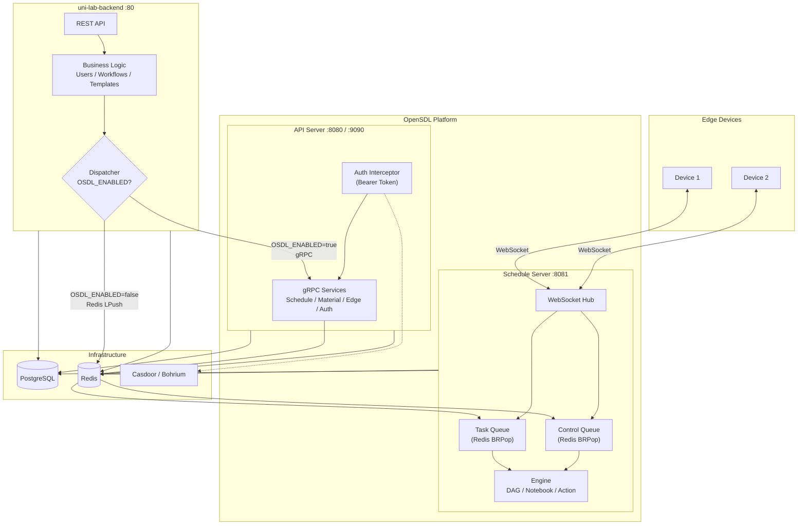
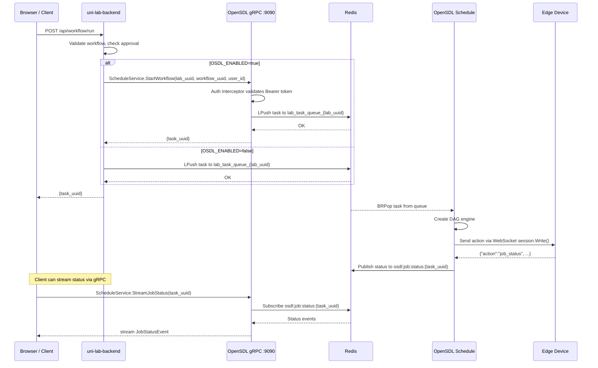
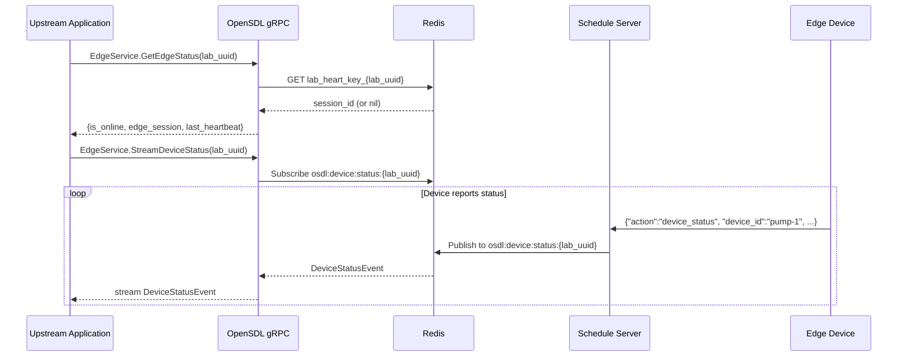

# Migrating uni-lab-backend to OpenSDL (Open Self-Driving Lab)

This guide describes how to integrate **uni-lab-backend** with **OpenSDL** via gRPC, enabling OpenSDL to handle Edge device communication and scheduling while uni-lab-backend retains business logic, templates, and user management.

## Overview

**OpenSDL** (Open Self-Driving Lab) is a decoupled, open-source communication infrastructure for scientific laboratory Edge devices. It provides WebSocket-based device connectivity, task scheduling (DAG Workflow / Notebook / Action), material graph management, and switchable authentication (Casdoor / Bohrium).

**License**: [AGPL-3.0](../LICENSE)

## Prerequisites

- Go 1.24+
- Docker & Docker Compose
- Redis 7+
- PostgreSQL 15+
- OpenSDL deployed and running (API server with gRPC on port 9090)

## Architecture

### System Overview

```
                    ┌──────────────────────────┐
                    │     uni-lab-backend       │
                    │  (Business Logic Layer)   │
                    │                           │
                    │  Users / Workflows /      │
                    │  Notebooks / Templates /  │
                    │  Approval / Storage       │
                    └──────────┬───────────────┘
                               │ gRPC (:9090)
                               │ OSDL_ENABLED=true
                               ▼
┌──────────────────────────────────────────────────────────────┐
│                      OpenSDL Platform                        │
│                                                              │
│  ┌────────────────────────┐   ┌───────────────────────────┐ │
│  │   API Server :8080     │   │  Schedule Server :8081    │ │
│  │   + gRPC    :9090      │   │  WebSocket Hub (Melody)   │ │
│  │                        │   │                           │ │
│  │  ScheduleService       │   │  Task Queue Consumer      │ │
│  │  MaterialService       │   │  Control Queue Consumer   │ │
│  │  EdgeService      ─────┼──→│  Engine: DAG/Notebook/    │ │
│  │  AuthService           │   │          Action           │ │
│  └────────────────────────┘   └──────────┬────────────────┘ │
│                                          │ WebSocket        │
└──────────────────────────────────────────┼──────────────────┘
                                           │
                    ┌──────────────────────┼─────────────────┐
                    │        Edge Devices (Uni-Lab-Edge)      │
                    │  ┌─────────┐ ┌─────────┐ ┌─────────┐  │
                    │  │ Device 1│ │ Device 2│ │ Device N│  │
                    │  └─────────┘ └─────────┘ └─────────┘  │
                    └────────────────────────────────────────┘
```

### Mermaid Architecture Diagram



### Sequence Diagram: Workflow Dispatch via gRPC



### Sequence Diagram: Edge Device Status via gRPC



## Docker Compose Configuration

```yaml
version: "3.8"
services:
  postgres:
    image: postgres:15
    environment:
      POSTGRES_USER: postgres
      POSTGRES_PASSWORD: osdl
      POSTGRES_DB: osdl
    ports:
      - "5432:5432"
    volumes:
      - pgdata:/var/lib/postgresql/data

  redis:
    image: redis:7-alpine
    ports:
      - "6379:6379"

  osdl-api:
    image: osdl:latest
    command: apiserver
    environment:
      DATABASE_HOST: postgres
      DATABASE_PORT: 5432
      DATABASE_NAME: osdl
      DATABASE_USER: postgres
      DATABASE_PASSWORD: osdl
      REDIS_HOST: redis
      REDIS_PORT: 6379
      WEB_PORT: 8080
      GRPC_PORT: 9090
    ports:
      - "8080:8080"
      - "9090:9090"
    depends_on:
      - postgres
      - redis

  osdl-schedule:
    image: osdl:latest
    command: schedule
    environment:
      DATABASE_HOST: postgres
      DATABASE_PORT: 5432
      DATABASE_NAME: osdl
      DATABASE_USER: postgres
      DATABASE_PASSWORD: osdl
      REDIS_HOST: redis
      REDIS_PORT: 6379
      SCHEDULE_PORT: 8081
    ports:
      - "8081:8081"
    depends_on:
      - postgres
      - redis

  uni-lab-backend:
    image: uni-lab-backend:latest
    command: apiserver
    environment:
      DATABASE_HOST: postgres
      REDIS_HOST: redis
      WEB_PORT: 80
      OSDL_ENABLED: "true"
      OSDL_GRPC_ADDR: "osdl-api:9090"
    ports:
      - "80:80"
    depends_on:
      - osdl-api
      - redis
      - postgres

volumes:
  pgdata:
```

## Environment Variables

### OpenSDL

| Variable | Default | Description |
|----------|---------|-------------|
| `WEB_PORT` | `8080` | HTTP API port |
| `GRPC_PORT` | `9090` | gRPC server port |
| `SCHEDULE_PORT` | `8081` | Schedule WebSocket port |
| `DATABASE_HOST` | `localhost` | PostgreSQL host |
| `REDIS_HOST` | `127.0.0.1` | Redis host |
| `OAUTH_SOURCE` | `casdoor` | Auth backend (`casdoor` or `bohr`) |

### uni-lab-backend (new variables)

| Variable | Default | Description |
|----------|---------|-------------|
| `OSDL_ENABLED` | `false` | Enable OpenSDL gRPC integration |
| `OSDL_GRPC_ADDR` | `localhost:9090` | OpenSDL gRPC server address |

## gRPC Services

| Service | Methods | Description |
|---------|---------|-------------|
| `ScheduleService` | `StartWorkflow`, `StartNotebook`, `StartAction`, `StopJob`, `StreamJobStatus` | Task scheduling and lifecycle |
| `MaterialService` | `EdgeCreateMaterial`, `EdgeUpsertMaterial`, `EdgeCreateEdge`, `QueryMaterial`, `DownloadMaterial` | Material graph CRUD |
| `EdgeService` | `GetEdgeStatus`, `StreamDeviceStatus` | Edge device status query and streaming |
| `AuthService` | `Login`, `Callback`, `Refresh` | OAuth2 authentication (stub) |

## Quick Start

1. **Build images:**
   ```bash
   cd osdl && docker build -t osdl:latest .
   cd uni-lab-backend && docker build -t uni-lab-backend:latest .
   ```

2. **Start services:**
   ```bash
   docker compose up -d
   ```

3. **Run migrations:**
   ```bash
   docker compose exec osdl-api ./osdl migrate
   ```

4. **Verify:**
   ```bash
   # Check OpenSDL gRPC
   grpcurl -plaintext localhost:9090 list
   # Check uni-lab-backend
   curl http://localhost/health
   ```

## Rollback

To disable OpenSDL integration and revert to direct Redis behavior:

1. Set `OSDL_ENABLED=false` in uni-lab-backend environment
2. Restart uni-lab-backend:
   ```bash
   docker compose restart uni-lab-backend
   ```

No data migration is needed. The rollback is instant since the underlying Redis queue format is unchanged.

## License

OpenSDL is licensed under [AGPL-3.0](../LICENSE).
