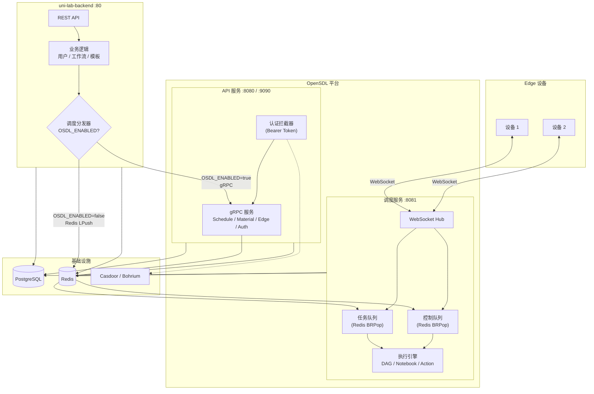
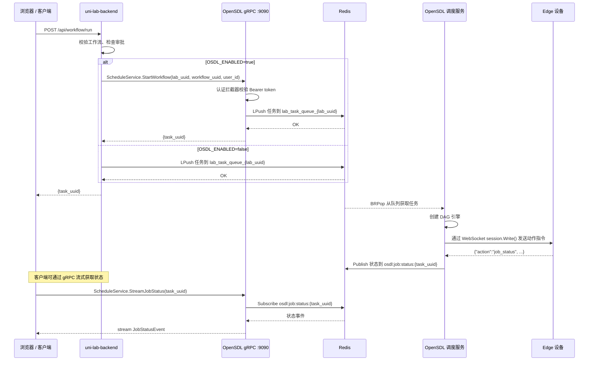
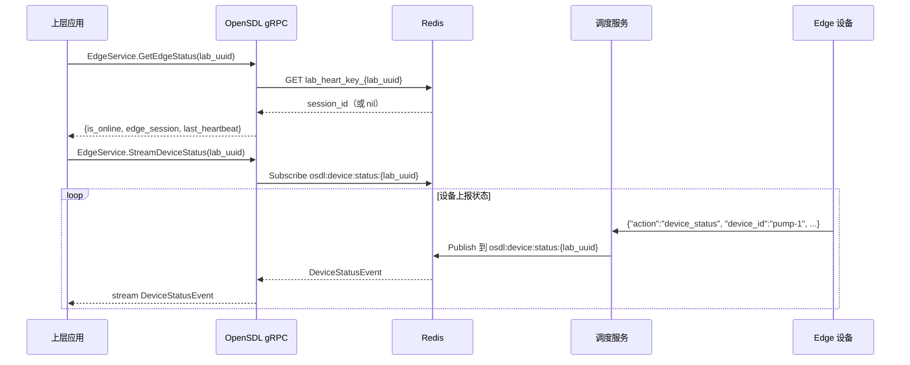

# 从 uni-lab-backend 迁移到 OpenSDL（开放自驱实验室）

本文档描述如何通过 gRPC 将 **uni-lab-backend** 与 **OpenSDL** 集成，使 OpenSDL 处理 Edge 设备通信和调度，uni-lab-backend 保留业务逻辑、模板管理和用户管理。

## 概述

**OpenSDL**（Open Self-Driving Lab，开放自驱实验室）是面向科学实验室 Edge 设备的解耦式开源通信基础设施。提供 WebSocket 设备连接、任务调度（DAG 工作流 / 实验记录本 / 单步 Action）、物料拓扑管理和可切换认证后端（Casdoor / Bohrium）。

**协议**: [AGPL-3.0](../LICENSE)

## 前提条件

- Go 1.24+
- Docker & Docker Compose
- Redis 7+
- PostgreSQL 15+
- OpenSDL 已部署运行（API 服务 gRPC 端口 9090）

## 架构

### 系统总览

```
                    ┌──────────────────────────┐
                    │     uni-lab-backend       │
                    │      （业务逻辑层）        │
                    │                           │
                    │  用户 / 工作流 / 实验本 / │
                    │  模板 / 审批 / 存储       │
                    └──────────┬───────────────┘
                               │ gRPC (:9090)
                               │ OSDL_ENABLED=true
                               ▼
┌──────────────────────────────────────────────────────────────┐
│                      OpenSDL 平台                            │
│                                                              │
│  ┌────────────────────────┐   ┌───────────────────────────┐ │
│  │   API 服务 :8080       │   │  调度服务 :8081           │ │
│  │   + gRPC  :9090        │   │  WebSocket Hub (Melody)   │ │
│  │                        │   │                           │ │
│  │  ScheduleService       │   │  任务队列消费者           │ │
│  │  MaterialService       │   │  控制队列消费者           │ │
│  │  EdgeService      ─────┼──→│  引擎: DAG / Notebook /   │ │
│  │  AuthService           │   │        Action             │ │
│  └────────────────────────┘   └──────────┬────────────────┘ │
│                                          │ WebSocket        │
└──────────────────────────────────────────┼──────────────────┘
                                           │
                    ┌──────────────────────┼─────────────────┐
                    │     Edge 设备 (Uni-Lab-Edge / unilabos) │
                    │  ┌─────────┐ ┌─────────┐ ┌─────────┐  │
                    │  │ 设备 1  │ │ 设备 2  │ │ 设备 N  │  │
                    │  └─────────┘ └─────────┘ └─────────┘  │
                    └────────────────────────────────────────┘
```

### Mermaid 架构图



### 时序图：通过 gRPC 分发工作流



### 时序图：通过 gRPC 查询 Edge 设备状态



## Docker Compose 配置示例

```yaml
version: "3.8"
services:
  postgres:
    image: postgres:15
    environment:
      POSTGRES_USER: postgres
      POSTGRES_PASSWORD: osdl
      POSTGRES_DB: osdl
    ports:
      - "5432:5432"
    volumes:
      - pgdata:/var/lib/postgresql/data

  redis:
    image: redis:7-alpine
    ports:
      - "6379:6379"

  osdl-api:
    image: osdl:latest
    command: apiserver
    environment:
      DATABASE_HOST: postgres
      DATABASE_PORT: 5432
      DATABASE_NAME: osdl
      DATABASE_USER: postgres
      DATABASE_PASSWORD: osdl
      REDIS_HOST: redis
      REDIS_PORT: 6379
      WEB_PORT: 8080
      GRPC_PORT: 9090
    ports:
      - "8080:8080"
      - "9090:9090"
    depends_on:
      - postgres
      - redis

  osdl-schedule:
    image: osdl:latest
    command: schedule
    environment:
      DATABASE_HOST: postgres
      DATABASE_PORT: 5432
      DATABASE_NAME: osdl
      DATABASE_USER: postgres
      DATABASE_PASSWORD: osdl
      REDIS_HOST: redis
      REDIS_PORT: 6379
      SCHEDULE_PORT: 8081
    ports:
      - "8081:8081"
    depends_on:
      - postgres
      - redis

  uni-lab-backend:
    image: uni-lab-backend:latest
    command: apiserver
    environment:
      DATABASE_HOST: postgres
      REDIS_HOST: redis
      WEB_PORT: 80
      OSDL_ENABLED: "true"
      OSDL_GRPC_ADDR: "osdl-api:9090"
    ports:
      - "80:80"
    depends_on:
      - osdl-api
      - redis
      - postgres

volumes:
  pgdata:
```

## 环境变量说明

### OpenSDL

| 变量 | 默认值 | 说明 |
|------|--------|------|
| `WEB_PORT` | `8080` | HTTP API 端口 |
| `GRPC_PORT` | `9090` | gRPC 服务端口 |
| `SCHEDULE_PORT` | `8081` | Schedule WebSocket 端口 |
| `DATABASE_HOST` | `localhost` | PostgreSQL 地址 |
| `REDIS_HOST` | `127.0.0.1` | Redis 地址 |
| `OAUTH_SOURCE` | `casdoor` | 认证后端（`casdoor` 或 `bohr`） |

### uni-lab-backend（新增变量）

| 变量 | 默认值 | 说明 |
|------|--------|------|
| `OSDL_ENABLED` | `false` | 是否启用 OpenSDL gRPC 集成 |
| `OSDL_GRPC_ADDR` | `localhost:9090` | OpenSDL gRPC 服务地址 |

## gRPC 服务

| 服务 | 方法 | 说明 |
|------|------|------|
| `ScheduleService` | `StartWorkflow`, `StartNotebook`, `StartAction`, `StopJob`, `StreamJobStatus` | 任务调度与生命周期 |
| `MaterialService` | `EdgeCreateMaterial`, `EdgeUpsertMaterial`, `EdgeCreateEdge`, `QueryMaterial`, `DownloadMaterial` | 物料拓扑 CRUD |
| `EdgeService` | `GetEdgeStatus`, `StreamDeviceStatus` | Edge 设备状态查询与流式推送 |
| `AuthService` | `Login`, `Callback`, `Refresh` | OAuth2 认证（预留） |

## 一键启动步骤

1. **构建镜像：**
   ```bash
   cd osdl && docker build -t osdl:latest .
   cd uni-lab-backend && docker build -t uni-lab-backend:latest .
   ```

2. **启动服务：**
   ```bash
   docker compose up -d
   ```

3. **执行数据库迁移：**
   ```bash
   docker compose exec osdl-api ./osdl migrate
   ```

4. **验证：**
   ```bash
   # 检查 OpenSDL gRPC
   grpcurl -plaintext localhost:9090 list
   # 检查 uni-lab-backend
   curl http://localhost/health
   ```

## 回滚方法

如需禁用 OpenSDL 集成，恢复直接 Redis 行为：

1. 在 uni-lab-backend 环境变量中设置 `OSDL_ENABLED=false`
2. 重启 uni-lab-backend：
   ```bash
   docker compose restart uni-lab-backend
   ```

无需数据迁移 — 回滚是即时的，因为底层 Redis 队列格式不变。

## 协议

OpenSDL 采用 [AGPL-3.0](../LICENSE) 开源协议。
