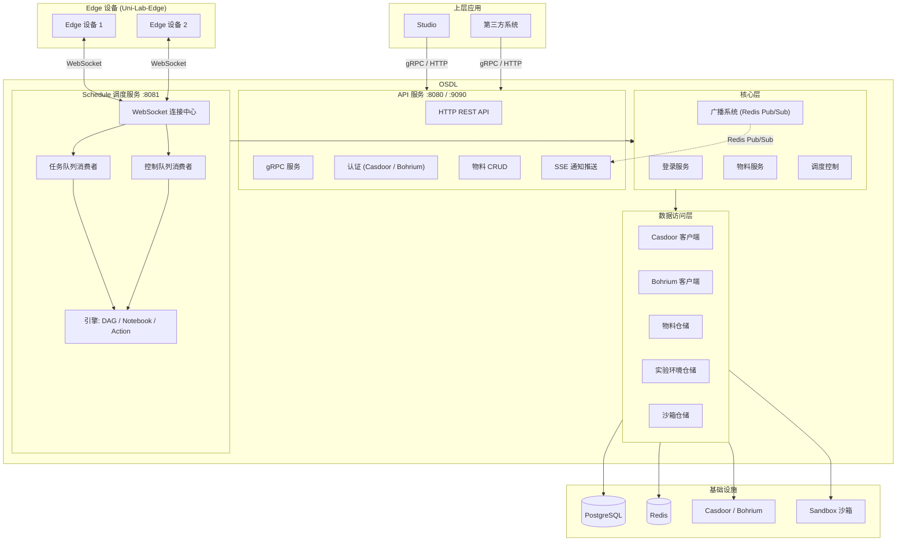
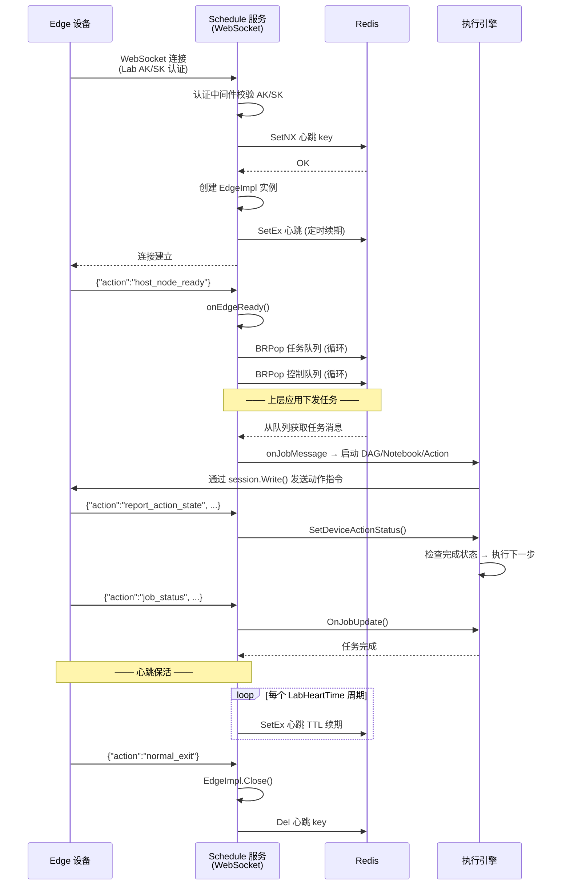
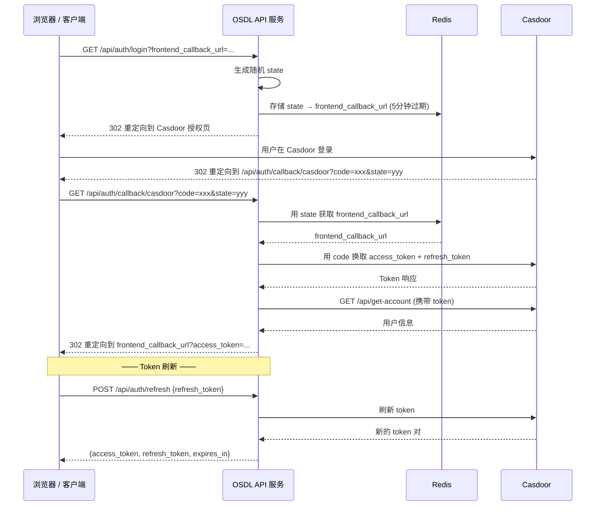
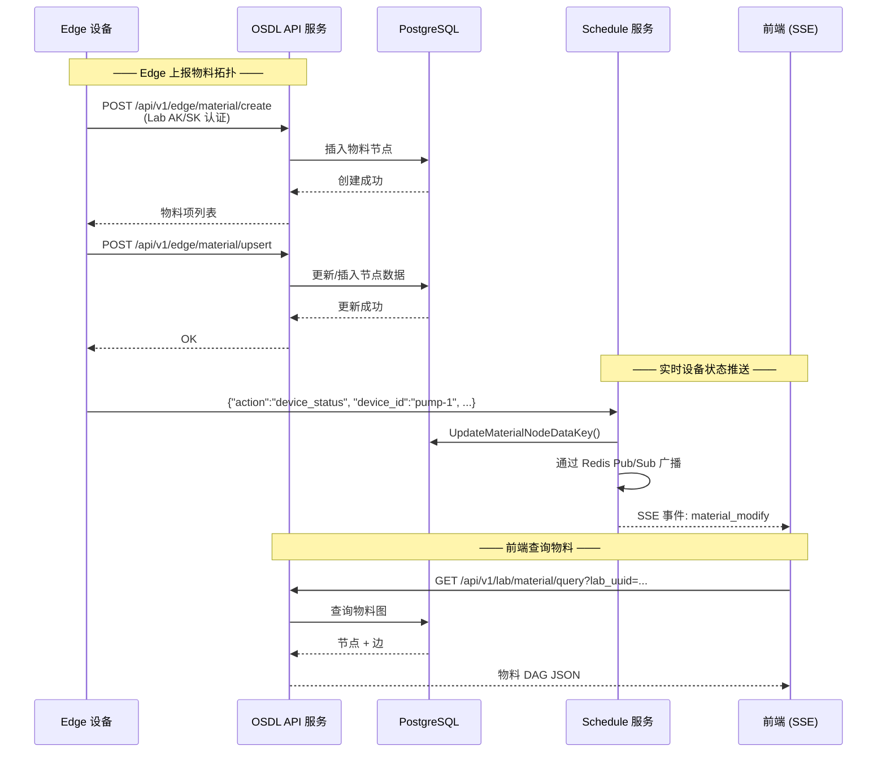
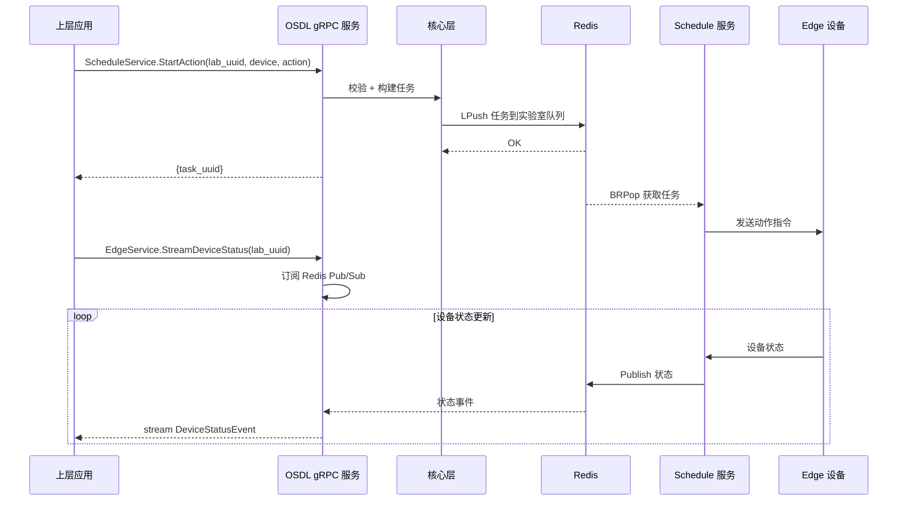

# OSDL — 开放科学设备实验室

**OSDL**（Open Science Device Lab）是一套解耦的、开源的科学实验室 Edge 设备通信基础设施。上层应用（如 Studio、第三方系统）通过 OSDL 提供的 gRPC / HTTP API 与 Edge 设备进行交互，Edge 端软件如 [Uni-Lab-Edge](https://github.com/Uni-Lab-Edge/unilabos)（DeepModeling 社区项目）从设备端连接到 OSDL。OSDL 负责完整的生命周期管理：WebSocket 连接、实时消息传递、任务调度（DAG / Notebook / Action）、物料拓扑管理、以及可切换的认证后端（[Casdoor](https://casdoor.org/) 或 [Bohrium](https://bohrium.dp.tech/)）。

> **语言 / Language**: 中文 | [English](../README.md)

---

## 系统架构

```
┌──────────────────────────────────────────────────────────────────────┐
│                       上层应用 (Upstream)                             │
│                      Studio  ·  第三方系统                            │
└──────────┬──────────────────────────────────┬────────────────────────┘
           │  gRPC (端口 9090)                │  HTTP REST (端口 8080)
           ▼                                  ▼
┌──────────────────────────────────────────────────────────────────────┐
│                          OSDL API 服务                               │
│                                                                      │
│  ┌─────────────┐  ┌──────────────┐  ┌────────────┐  ┌────────────┐ │
│  │  认证模块    │  │  物料管理    │  │ SSE 通知   │  │  gRPC 层   │ │
│  │(Casdoor/Bohr)│  │  CRUD & DAG  │  │  (Events)  │  │   服务     │ │
│  └──────┬──────┘  └──────┬───────┘  └─────┬──────┘  └──────┬─────┘ │
│         ▼                ▼                 ▼                ▼       │
│  ┌──────────────────────────────────────────────────────────────┐   │
│  │                      核心业务层 (Core)                       │   │
│  │    Login ─── Material ─── Schedule ─── Notify (广播)         │   │
│  └──────────────────────────────────┬───────────────────────────┘   │
│  ┌──────────────────────────────────┴───────────────────────────┐   │
│  │                     数据访问层 (Repository)                   │   │
│  │  Casdoor ─ Bohrium ─ Material ─ Environment ─ Sandbox        │   │
│  └──────────────────────────────────┬───────────────────────────┘   │
└──────────────────────────────────────┼──────────────────────────────┘
                                       │
           ┌───────────────────────────┼───────────────────────────┐
           ▼                           ▼                           ▼
    ┌─────────────┐           ┌──────────────┐       ┌─────────────────┐
    │  PostgreSQL  │           │    Redis     │       │ Casdoor / Bohr  │
    │  (持久化)    │           │ (队列/发布)  │       │  (认证后端)     │
    └─────────────┘           └──────────────┘       └─────────────────┘

┌──────────────────────────────────────────────────────────────────────┐
│                       OSDL Schedule 调度服务                         │
│                                                                      │
│  ┌────────────────────────────────────────────────────────────────┐  │
│  │                    WebSocket Hub (Melody)                      │  │
│  │                                                                │  │
│  │   Edge A ←──ws──→  Control  ←──ws──→  Edge B                  │  │
│  └───────────┬──────────────────────────────────┬────────────────┘  │
│   ┌──────────▼──────────┐          ┌────────────▼─────────────┐     │
│   │ 任务队列 (Redis)    │          │  控制队列 (Redis)        │     │
│   │   BRPop 消费者      │          │   BRPop 消费者           │     │
│   └──────────┬──────────┘          └────────────┬─────────────┘     │
│   ┌──────────▼──────────────────────────────────▼─────────────┐     │
│   │                     执行引擎 (Engine)                      │     │
│   │     DAG 工作流 ─── Notebook 实验本 ─── 单步 Action         │     │
│   └───────────────────────────────────────────────────────────┘     │
└──────────────────────────────────────────────────────────────────────┘

┌──────────────────────────────────────────────────────────────────────┐
│                  Edge 设备端 (Uni-Lab-Edge)                          │
│          github.com/Uni-Lab-Edge/unilabos (DeepModeling 社区)       │
│  ┌────────────┐  ┌────────────┐  ┌────────────┐                    │
│  │  Edge 设备 1│  │  Edge 设备 2│  │  Edge 设备 N│                    │
│  └──────┬─────┘  └──────┬─────┘  └──────┬─────┘                    │
│         └───────────┬────┘───────────────┘                          │
│                     │ WebSocket (:8081)                              │
└─────────────────────┼───────────────────────────────────────────────┘
                      ▼
              OSDL Schedule 调度服务
```

### Mermaid 架构图



---

## 时序图

### 1. Edge 设备连接与任务执行



### 2. OAuth2 登录流程 (Casdoor)



### 3. 物料同步 (Edge ↔ 平台)



### 4. gRPC 服务调用流程



---

## 目录结构

```
osdl/
├── main.go                          # 入口 — Cobra CLI (apiserver / schedule / migrate)
├── go.mod
├── Makefile                         # 构建、开发、Docker、代码检查
├── Dockerfile                       # 多阶段构建 (alpine)
├── docker-compose.yml               # 全栈部署: postgres + redis + osdl-api + osdl-schedule
├── .env.example                     # 环境变量模板
│
├── cmd/
│   ├── api/server.go                # API 服务启动 (HTTP + gRPC + 优雅关闭)
│   └── schedule/server.go           # Schedule 服务启动 (WebSocket + Redis 消费)
│
├── internal/config/                 # 配置管理 (环境变量, Viper)
│
├── proto/osdl/v1/                   # gRPC Proto 定义
│   ├── edge.proto                   # EdgeService — 设备状态查询与流式推送
│   ├── schedule.proto               # ScheduleService — 工作流/实验本/动作调度
│   ├── material.proto               # MaterialService — 物料 CRUD
│   └── auth.proto                   # AuthService — OAuth2 登录/回调/刷新
│
├── pkg/
│   ├── common/                      # 公共: UUID、错误码、常量、响应结构
│   ├── core/
│   │   ├── login/casdoor/           # Casdoor OAuth2 实现
│   │   ├── material/                # 物料业务逻辑 + Edge 同步
│   │   ├── schedule/
│   │   │   ├── control/             # WebSocket 连接中心 (Melody) + 连接生命周期
│   │   │   ├── lab/edge/            # EdgeImpl — 消息路由 & 队列消费
│   │   │   └── engine/              # 任务执行: DAG、Notebook、Action
│   │   └── notify/events/           # Redis Pub/Sub 广播系统
│   ├── grpc/                        # gRPC 服务启动
│   ├── middleware/                   # 中间件: Auth、DB、Redis、Logger、OpenTelemetry
│   ├── repo/                        # 数据仓储接口 + 实现
│   │   ├── casdoor/                 # Casdoor 认证后端
│   │   └── bohr/                    # Bohrium 认证后端
│   ├── utils/                       # 工具: DAG、JWT、信号处理、并发安全
│   └── web/                         # Gin HTTP 路由 + 处理器
│       └── views/                   # health、login、material、schedule、sse
│
└── gen/osdl/v1/                     # protoc 生成的 Go 代码
```

---

## 快速开始

### 环境要求

- Go 1.24+
- PostgreSQL 16+
- Redis 7+
- [Casdoor](https://casdoor.org/) 实例（默认认证后端）**或** [Bohrium](https://bohrium.dp.tech/) 账号（设置 `OAUTH_SOURCE=bohr`）

### 本地开发

```bash
# 1. 克隆项目
git clone https://github.com/ScienceOL/OSDL.git && cd OSDL

# 2. 复制并编辑配置文件
cp .env.example .env
# 编辑 .env，填入数据库、Redis、Casdoor 配置

# 3. 安装依赖
make init

# 4. 数据库迁移
make migrate

# 5. 启动 API 服务 (HTTP :8080 + gRPC :9090)
make apiserver

# 6. 启动 Schedule 服务 (WebSocket :8081) — 另一个终端
make schedule
```

### Docker Compose 一键启动

```bash
# 启动全部服务: PostgreSQL + Redis + 迁移 + API + Schedule
make docker-up

# 查看日志
make docker-logs

# 停止
make docker-down
```

---

## API 接口

### 健康检查

| 方法   | 路径                | 说明                          |
|--------|---------------------|-------------------------------|
| GET    | `/api/health`       | 基本健康检查                  |
| GET    | `/api/health/live`  | 存活探针 (始终返回 OK)        |
| GET    | `/api/health/ready` | 就绪探针 (检查 PG + Redis)    |

### 认证

| 方法   | 路径                           | 说明                    |
|--------|--------------------------------|-------------------------|
| GET    | `/api/auth/login`              | 发起 Casdoor OAuth2 登录 |
| GET    | `/api/auth/callback/casdoor`   | OAuth2 回调              |
| POST   | `/api/auth/refresh`            | 刷新 access token        |

### 物料管理 (Bearer 认证)

| 方法   | 路径                                      | 说明            |
|--------|-------------------------------------------|-----------------|
| POST   | `/api/v1/lab/material/create`             | 创建实验室物料  |
| POST   | `/api/v1/lab/material/save`               | 保存物料        |
| GET    | `/api/v1/lab/material/query`              | 查询物料列表    |
| PUT    | `/api/v1/lab/material/update`             | 批量更新        |
| GET    | `/api/v1/lab/material/download/:lab_uuid` | 下载物料图      |

### Edge 设备 API (Lab AK/SK 认证)

| 方法   | 路径                                | 说明                |
|--------|-------------------------------------|---------------------|
| POST   | `/api/v1/edge/material/create`      | Edge 创建物料节点   |
| POST   | `/api/v1/edge/material/upsert`      | Edge 更新/创建物料  |
| POST   | `/api/v1/edge/material/edge`        | Edge 创建连线       |
| GET    | `/api/v1/edge/material/download`    | Edge 下载物料 DAG   |

### WebSocket

| 路径                                  | 服务     | 说明                         |
|---------------------------------------|----------|------------------------------|
| `/api/v1/ws/material/:lab_uuid`       | API      | 物料实时更新                 |
| `/api/v1/ws/schedule`                 | Schedule | Edge 设备 ↔ OSDL 通信通道   |

### SSE 推送

| 路径                      | 说明                        |
|---------------------------|-----------------------------|
| `/api/v1/lab/notify/sse`  | Server-Sent Events 广播通知 |

### gRPC 服务 (端口 9090)

| 服务               | 方法                                                                  |
|--------------------|-----------------------------------------------------------------------|
| `EdgeService`      | `GetEdgeStatus`, `StreamDeviceStatus`                                 |
| `ScheduleService`  | `StartWorkflow`, `StartNotebook`, `StartAction`, `StopJob`, `StreamJobStatus` |
| `MaterialService`  | `EdgeCreateMaterial`, `EdgeUpsertMaterial`, `EdgeCreateEdge`, `QueryMaterial`, `DownloadMaterial` |
| `AuthService`      | `Login`, `Callback`, `Refresh`                                        |

---

## 配置项

通过环境变量配置（从 `.env` 加载）：

| 变量名                  | 默认值          | 说明                        |
|-------------------------|-----------------|-----------------------------|
| `DATABASE_HOST`         | `localhost`     | PostgreSQL 主机             |
| `DATABASE_PORT`         | `5432`          | PostgreSQL 端口             |
| `DATABASE_NAME`         | `osdl`          | 数据库名                    |
| `DATABASE_USER`         | `postgres`      | 数据库用户                  |
| `DATABASE_PASSWORD`     | `osdl`          | 数据库密码                  |
| `REDIS_HOST`            | `127.0.0.1`    | Redis 主机                  |
| `REDIS_PORT`            | `6379`          | Redis 端口                  |
| `WEB_PORT`              | `8080`          | HTTP API 端口               |
| `SCHEDULE_PORT`         | `8081`          | Schedule WebSocket 端口     |
| `GRPC_PORT`             | `9090`          | gRPC 端口                   |
| `OAUTH2_CLIENT_ID`      | —               | Casdoor OAuth2 Client ID    |
| `OAUTH2_CLIENT_SECRET`  | —               | Casdoor OAuth2 Client Secret|
| `CASDOOR_ADDR`          | —               | Casdoor 服务地址            |
| `OAUTH_SOURCE`          | `casdoor`       | 认证后端 (`casdoor` 或 `bohr`) |
| `BOHR_CORE_ADDR`        | —               | Bohrium Core API 地址       |
| `ACCOUNT_ADDR`          | —               | Bohrium Account API 地址    |
| `BOHR_ADDR`             | —               | Bohrium API 地址            |
| `SANDBOX_ADDR`          | —               | Sandbox 沙箱服务地址        |
| `LOG_LEVEL`             | `info`          | 日志级别                    |
| `ENV`                   | `dev`           | 运行环境 (dev/prod)         |

完整配置参见 [`.env.example`](../.env.example)。

---

## Make 命令

```bash
make help          # 显示所有可用命令
make init          # 下载并整理依赖
make apiserver     # 启动 API 服务
make schedule      # 启动 Schedule 服务
make migrate       # 执行数据库迁移
make build         # 构建二进制
make build-linux   # 交叉编译 Linux 版本
make proto         # 从 proto 文件生成 gRPC 代码
make test          # 运行测试
make fmt           # 格式化代码
make vet           # Go vet 检查
make lint          # 代码检查 (golangci-lint)
make docker-build  # 构建 Docker 镜像
make docker-up     # Docker Compose 一键启动
make docker-down   # 停止所有服务
make docker-logs   # 查看日志
make clean         # 清理构建产物
```

---

## 技术栈

| 组件       | 技术                                          |
|------------|-----------------------------------------------|
| 语言       | Go 1.24                                       |
| HTTP 框架  | [Gin](https://github.com/gin-gonic/gin)       |
| WebSocket  | [Melody](https://github.com/olahol/melody)    |
| gRPC       | [gRPC-Go](https://google.golang.org/grpc)     |
| ORM        | [GORM](https://gorm.io/) + PostgreSQL         |
| 缓存/队列  | [Redis](https://redis.io/) (go-redis/v9)      |
| 认证       | [Casdoor](https://casdoor.org/) 或 [Bohrium](https://bohrium.dp.tech/) |
| CLI        | [Cobra](https://github.com/spf13/cobra)       |
| 配置       | [Viper](https://github.com/spf13/viper)       |
| 日志       | [Zap](https://github.com/uber-go/zap)         |
| 链路追踪   | [OpenTelemetry](https://opentelemetry.io/)     |
| 协程池     | [ants](https://github.com/panjf2000/ants)     |
| 容器化     | Docker + Docker Compose                        |

---

## 开源协议

[Apache License 2.0](../LICENSE)
